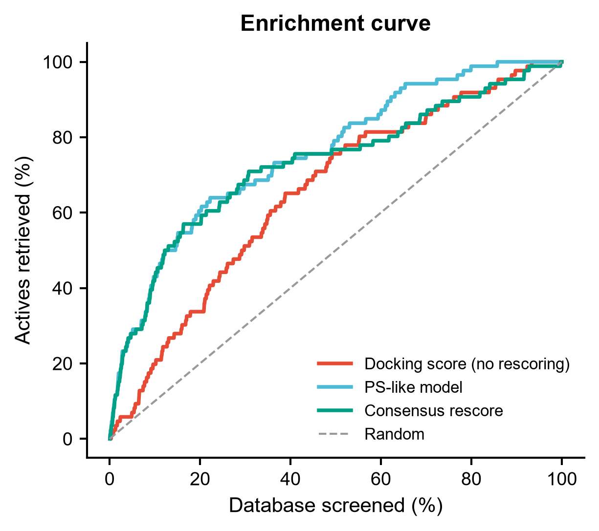
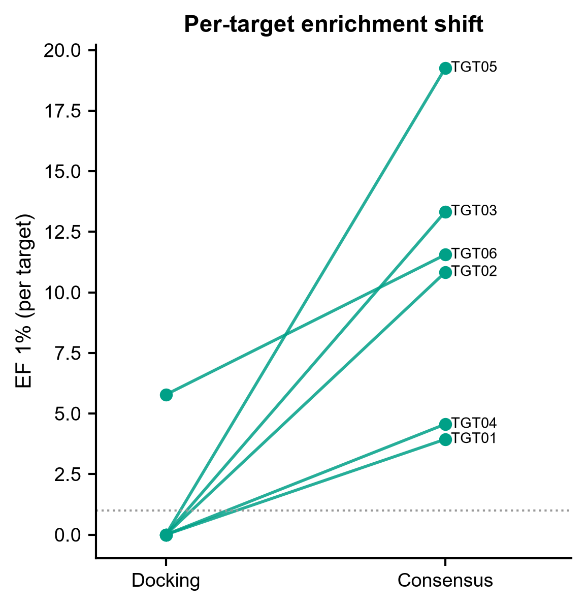
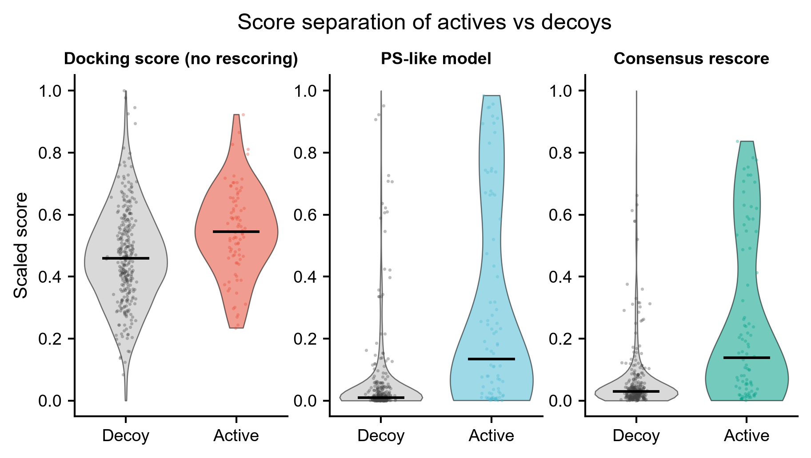
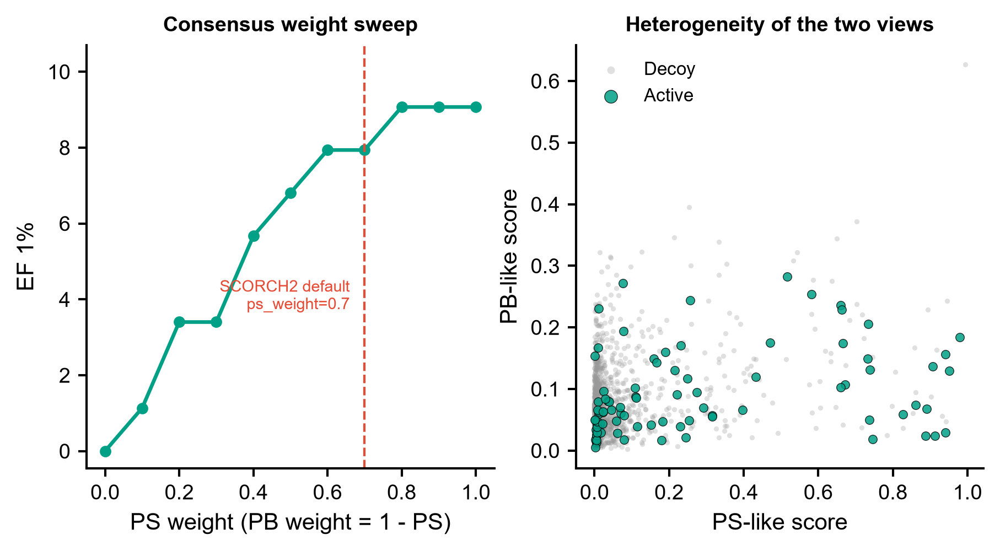

# 596 · SCORCH2 — 共识机器学习重打分与虚拟筛选富集评测

> 输入 **docking pose 级相互作用特征表** → 双视图共识重打分 + 按靶点分层富集评测(EF1%/EF5%/BEDROC/AUROC)→ 出富集曲线 / slopegraph / violin / 权重扫描图。上游 SCORCH2 走**守卫式封装**。

| | |
|---|---|
| **语言 / 主依赖** | Python 3.12 · `numpy` `pandas` `scikit-learn` `matplotlib`(本机已装)· SCORCH2 本体需 `xgboost` + Zenodo 权重 |
| **一句话用途** | 评估「重打分到底比原始 docking score 富集提升了多少」,并给出可复现的共识重打分对照 |
| **输入** | `example_data/vs_docking_poses.csv`(合成) |
| **输出** | `results/`(运行生成)· 展示图见 `assets/` |
| **状态** | 🟡 诚实基线 + 富集评测骨架本机零改动跑通;SCORCH2 本体需装 `xgboost` 并下载权重 |

---

## ① 输入数据

**文件**:`vs_docking_poses.csv`(csv;行 = 一个 **pose**,同一 compound 可有多个 pose)

| 列名 | 类型 | 必需 | 示例 | 说明 |
|------|------|:---:|------|------|
| `target` | str | ✔ | `TGT01` | 靶点 ID;交叉验证按它分组,防靶点泄漏 |
| `compound_id` | str | ✔ | `TGT01_CMPD0001` | 化合物 ID;best-pose 聚合的单位 |
| `pose_id` | str | | `pose1` | 位姿编号 |
| `docking_score` | float | ✔ | `-5.344` | 对接打分,**越负越好**(脚本内部取负统一为"越大越好") |
| `label` | int | ✔ | `0` | 1 = active,0 = decoy |
| `ecif_CC` `ecif_CN` `ecif_CO` `ecif_arom` | float | ✔ | `4.0` | ECIF 风格相互作用计数(PS 视图) |
| `binana_hbond` `binana_hydrophobic` `binana_saltbridge` `binana_pistack` | float | ✔ | `4.0` | BINANA 风格相互作用计数(PS 视图) |
| `kier_flex` `mw` `logp` `tpsa` `rot_bonds` `pose_rmsd_ref` | float | ✔ | `3.428` | Kier 柔性 + 理化/位姿描述符(PB 视图) |

**命名/格式约定**:`#` 开头的行按注释跳过。特征列名固定(见脚本顶部 `PS_FEATS` / `PB_FEATS`),换自己的数据时改这两个列表即可。

**样例(前 3 行)**:
```
# synthetic, for demo only - NOT real docking output.
target,compound_id,pose_id,docking_score,label,ecif_CC,ecif_CN,...,pose_rmsd_ref
TGT01,TGT01_CMPD0001,pose1,-5.344,0,4.0,5.0,...,2.078
TGT01,TGT01_CMPD0001,pose2,-2.727,0,11.0,5.0,...,0.583
```

## ② 方法 / 原理

**上游 SCORCH2**(Chen et al., *Advanced Science* 2025):从 pdbqt 结构提取 ECIF + BINANA +
Kier flexibility + RDKit 描述符,喂给两个在**不同训练集**上训练的异质 XGBoost 模型
**SC2-PS** 与 **SC2-PB**,按 `--ps_weight 0.7` / `--pb_weight 0.3` 加权共识,对 docking pose
重打分以提升 hit enrichment。上游只暴露 **CLI**(`scorch2_rescoring.py`),无 PyPI 包、
无稳定 Python 函数签名,权重须从 Zenodo 单独下载 —— 因此本模块把它写成**守卫式封装**
(`run_scorch2()`):缺 `xgboost` 或缺权重时优雅退出,并打印按上游 README 拼写核对过的真实命令。
**不在此处固定任何 Python 函数签名**,以官方仓库为准。

**本机可跑的部分**(本模块的实际交付):
1. **基线 0 · 原始 docking score**:不做任何重打分的地板。任何"重打分更好"的说法都必须对着它报。
2. **基线 1 · 本地 consensus 代理模型**:两个异质学习器分看两组特征 ——
   PS-like = `HistGradientBoostingClassifier`(只看相互作用特征),
   PB-like = 标准化 + `LogisticRegression`(只看理化/位姿描述符),
   按 `ps_weight/pb_weight` 在概率尺度加权。**这不是 SCORCH2 的权重**,只是一个结构上模仿其
   共识思路、用本机依赖就能跑的可复现对照。
3. **防泄漏**:`GroupKFold` 按 `target` 分组,训练/评测靶点不重叠,取 out-of-fold 预测评测;
   `--aggregate` 对应的 best-pose 聚合在 **compound 层面**评测,避免同一化合物多 pose 伪重复计数。
4. **富集指标**:EF1% / EF5% / BEDROC(α=80.5,Truchon & Bayly 2007 公式)/ AUROC,总体 + 按靶点分层。
5. **共识权重扫描**:`ps_weight` 从 0 扫到 1,看 EF1% 怎么随权重变,并标出 SCORCH2 默认 0.7。

## ③ 用途

- 有一批 docking 输出(actives + decoys),想知道**重打分值不值得做**:富集提升多少、哪些靶点提升、哪些没提升。
- 上 SCORCH2 之前先用本模块把**评测骨架和地板**建好,免得拿到 SCORCH2 分数后没有对照可比。
- 需要一个**按靶点分层、无泄漏**的虚拟筛选富集评测流程(EF/BEDROC 的实现常被写错,这里给了可复核的实现)。

## ④ 特点 / 亮点

- **turnkey**:`python 596_scorch2_virtual_screening.py` 一条命令,没有输入文件就自己生成合成数据。
- **强制对照**:重打分永远和原始 docking score 并排报,不允许单独报一个漂亮的 EF。
- **防泄漏是默认行为**:按靶点 GroupKFold + compound 层面聚合,不是可选项。
- **不臆造 API**:SCORCH2 的 CLI 参数与默认值逐个核自**上游源码**
  `scorch2_rescoring.py:620-657`(不只是 README),Python 签名不编。上游 MIT 许可、
  无 `setup.py`/`pyproject.toml`(确认无 PyPI 包)、只暴露 CLI。
- **无条形图**:折线富集曲线 / slopegraph / violin+抖动散点 / 点线扫描 + 散点。

**示例数据上的结果**(seed=0,1560 compounds / 6 targets / 5.5% actives):

| 打分 | EF1% | EF5% | BEDROC | AUROC |
|---|---|---|---|---|
| docking(地板) | 2.27 | 1.40 | 0.108 | 0.661 |
| PS-like | 9.07 | 5.58 | 0.427 | 0.773 |
| PB-like | 0.00 | 1.86 | 0.083 | 0.583 |
| consensus (0.7/0.3) | 7.94 | 5.58 | 0.399 | 0.741 |

合成数据里 PB 视图信号被刻意造得弱,所以共识略低于单独的 PS —— 这是合成数据的性质,
**不是对 SCORCH2 真实性能的评价**。真实数据上两个视图谁更强、最优权重是多少,由权重扫描图去看。

## ⑤ 输出结果图

| 文件 | 图型 | 说明 |
|------|------|------|
| `assets/fig1_enrichment_curve.png` | 折线 | 富集曲线:检索比例 vs 命中活性比例,含随机对角线 |
| `assets/fig2_per_target_ef_slopegraph.png` | slopegraph | 每靶点 EF1% 从 docking 到 consensus 的位移 |
| `assets/fig3_score_separation_violin.png` | violin + 抖动散点 | 三种打分下 active/decoy 的分离程度 |
| `assets/fig4_weight_sweep_and_view_scatter.png` | 点线 + 散点 | 共识权重扫描(标 SCORCH2 默认 0.7)+ 两视图异质性 |

`results/` 另出 `overall_metrics.csv`、`per_target_metrics.csv`、`consensus_weight_sweep.csv`、
`compound_level_scores.csv`、`596_summary.json`,以及每张图的矢量 PDF。






---

## 运行

```bash
# 零改动跑示例(自动生成 example_data/)
python 596_scorch2_virtual_screening.py

# 换成自己的 pose 级特征表
python 596_scorch2_virtual_screening.py --input data/my_poses.csv --outdir results/run1

# 改共识权重
python 596_scorch2_virtual_screening.py --ps_weight 0.6 --pb_weight 0.4

# 打印/尝试真实 SCORCH2 路径(缺依赖时只打印命令,不报错退出)
python 596_scorch2_virtual_screening.py --run-scorch2 \
    --models-dir /path/to/sc2_weights \
    --protein-dir my_data/protein --ligand-dir my_data/molecule
```

## 依赖安装

本机基线部分**无需安装任何东西**(numpy / pandas / scikit-learn / matplotlib 已装)。

跑 SCORCH2 本体需要(本模块不代为安装):

```bash
git clone https://github.com/LinCompbio/SCORCH2
cd SCORCH2
conda env create -f environment.yml && conda activate scorch2   # Python >= 3.10
# 权重 sc2_ps.xgb / sc2_pb.xgb / sc2_ps_scaler / sc2_pb_scaler
# 从 https://zenodo.org/records/14994007 下载
```

输入须为 pdbqt,目录结构 `protein/{id}_protein.pdbqt` 与 `molecule/{id}/` 下的 pose pdbqt
(上游 `example_data/data_structure_example.md` 举例 `{id}_ligand_out_pose{N}.pdbqt`,但
`utils/scorch2_feature_extraction.py:437,454` 实际是 `glob('{protein_dir}/{pdbid}*.pdbqt')`
+ `os.listdir(molecule/{id})`,**不强制 pose 文件名模式** —— 上游自带 example_data 用的就是
`4a9r_172_decoy_out.pdbqt` 这种名字)。

转换用上游 `utils/receptor_2_pdbqt.py` / `utils/ligand_2_pdbqt.py`,二者是 `subprocess` 包装
**ADFRsuite** 的 `prepare_receptor` / `prepare_ligand`(`receptor_2_pdbqt.py:35`、
`ligand_2_pdbqt.py:23`)—— ADFRsuite **不在 `environment.yml` 里**,须按上游 README 的
Prerequisites 从 https://ccsb.scripps.edu/adfr/downloads/ 另装。
可解释性用上游 `shap_explanation.py`(仓库根目录,已确认存在)。

## 引用

Chen L, Blay V, Ballester PJ, Houston DR. **SCORCH2: A Generalized Heterogeneous Consensus
Model for High-Enrichment Interaction-Based Virtual Screening.** *Advanced Science* 2025;
e08318. doi:10.1002/advs.202508318 · **PMID 40832726** · PMC12622527
(PMID/DOI 已用 NCBI E-utilities esummary 核实,标题与期刊对得上)

前作:McGibbon M, Money-Kyrle S, Blay V, Houston DR. SCORCH: Improving structure-based
virtual screening with machine learning classifiers, data augmentation, and uncertainty
estimation. *J Adv Res* 2023;46:135-147.

BEDROC 指标:Truchon JF, Bayly CI. Evaluating virtual screening methods: good and bad
metrics for the "early recognition" problem. *J Chem Inf Model* 2007;47(2):488-508.

API 核对来源:本地克隆的上游源码 `C:\Users\fsy\Desktop\upstream-sources\596_SCORCH2\`
(2026-07-21 逐符号 grep 核对:`scorch2_rescoring.py` 的 argparse 段、
`utils/scorch2_feature_extraction.py` 的 ECIF/BINANA/Kier/RDKit 导入、
`utils/{receptor,ligand}_2_pdbqt.py` 的 ADFRsuite 调用)。
PMID/DOI/作者/期刊卷期用 NCBI E-utilities `efetch` 原文核实通过
(Adv Sci (Weinh). 2025 Nov;12(42):e08318;Chen L, Blay V, Ballester PJ, Houston DR;PMC12622527)。
