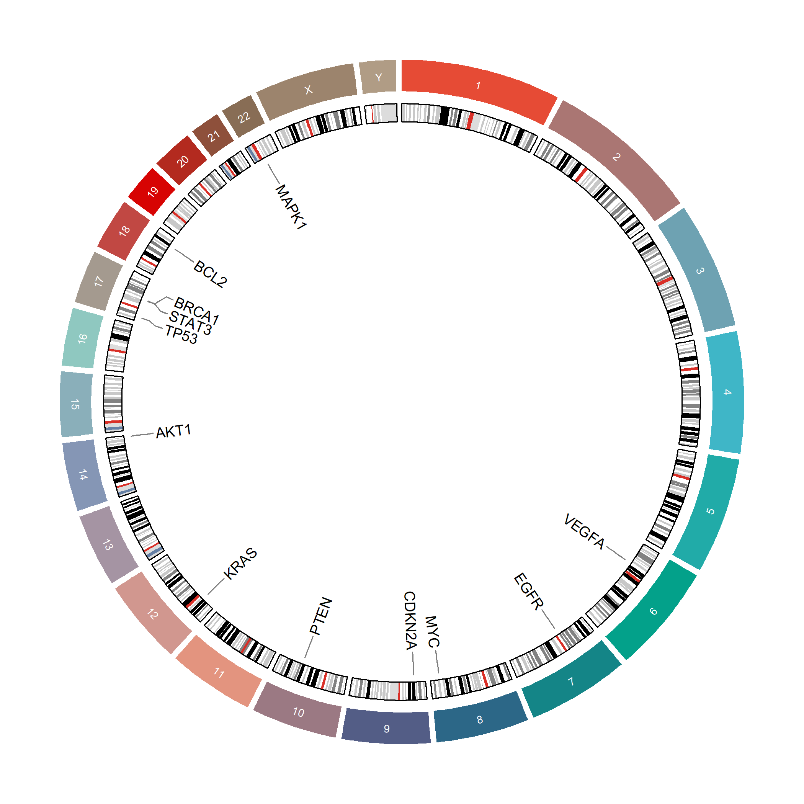

# 053 · circlize chromosome circos plot

Draws target genes onto chromosomes to show their genomic distribution, using R and `circlize`.

| | |
|---|---|
| **Language / main dependency** | R · `circlize` |
| **Purpose** | Plot target genes on chromosomes to show their distribution |
| **Input** | `example_data/gene_positions.csv` |
| **Output** | `results/` · example figure in `assets/` |

## Input

CSV with columns `Gene`, `Chr` (e.g. `chr17`), `Start`, `End` (genomic coordinates, available from NCBI Gene/UCSC).

## Method

`circos.initializeWithIdeogram` initializes the chromosome framework, with an outer colored chromosome track and a middle cytoband ideogram, then `circos.genomicLabels` adds the inner gene-label leader lines.

## Usage

Plots the chromosome distribution of a candidate gene set (differential, feature, or target genes) as a supplementary figure, showing genomic location and clustering.

## Features

- Runs from a single coordinate table; journal color scheme for chromosomes.
- Three-layer circos plot (chromosome + cytoband + gene labels).
- Supports `--genome hg38/hg19/mm10` (cytoband fetched online on first use).

## Outputs

| File | Type | Description |
|------|------|------|
| `assets/Chromosome_circos.png` | circos plot | Gene distribution on chromosomes |



## Run

```bash
Rscript 053_chromosome_circos.R                              # 示例(hg38)
Rscript 053_chromosome_circos.R --input data/gene_positions.csv --genome hg38
```

## Dependencies

```r
install.packages("circlize")
```
