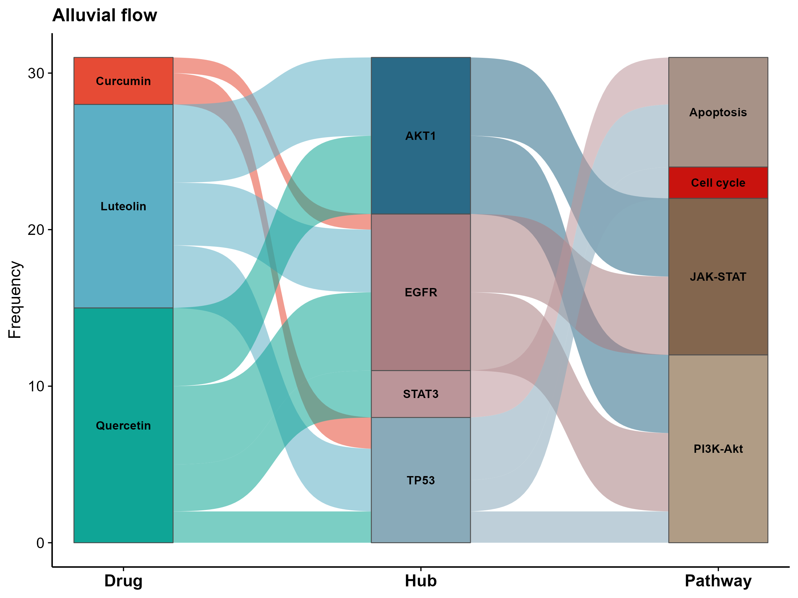

# 498 · ggalluvial Sankey/Alluvial Plot

Renders an alluvial/Sankey diagram showing flow relationships across multiple entity layers (e.g. drug → hub → pathway).

| | |
|---|---|
| Language / main dependencies | R · `ggalluvial` `ggplot2` |
| Purpose | Display flow relationships among multi-level entities |
| Input | `example_data/flow_table.csv` |
| Output | `results/`; example figure in `assets/` |

## Input

Long-format CSV: the first columns are the layers (2-4 layers, e.g. `Drug`/`Hub`/`Pathway`), and the last column is `Freq` (flow width; defaults to 1 per row).

## Method

`ggalluvial::to_lodes_form` converts the table, then `geom_flow` (sigmoid bands) plus `geom_stratum` (layer blocks) and labels produce the figure.

## Use Cases

Common figure for multi-level relationships such as network pharmacology "drug → hub → pathway" and cell communication "ligand → receptor → cell".

## Features

- Automatically detects the number of layers and the frequency column; works for 2-4 layers.
- Journal color palette and sigmoid flow bands.

## Outputs

| File | Type | Description |
|------|------|-------------|
| `assets/Alluvial.png` | Alluvial/Sankey | Multi-layer flow |



## Usage

```bash
Rscript 498_alluvial_sankey.R                              # 示例
Rscript 498_alluvial_sankey.R --input data/flow_table.csv
```

## Dependencies

```r
install.packages(c("ggalluvial","ggplot2"))
```
