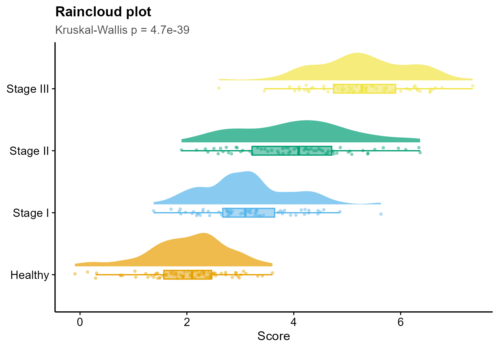

# 512 · Raincloud plot

A publication-grade distribution figure — half-violin density ("cloud") + boxplot +
jittered raw points ("rain") — that shows shape, quartiles, and every sample at once.
A high-information replacement for the bar chart in group comparisons.

| | |
|---|---|
| Language / deps | R · `ggplot2` `ggdist` (+ shared `theme_pub.R`) |
| Purpose | Compare a value across groups without hiding the distribution |
| Input | `--input data.csv` (`group,value`); else synthetic |
| Output | `results/` summaries; `assets/raincloud.png` |

## Method

`ggdist::stat_halfeye` (density cloud) + `geom_boxplot` (quartiles) + `geom_jitter`
(raw points), flipped horizontal. Stats: Kruskal–Wallis across groups + BH-adjusted
pairwise Wilcoxon (written to `results/`).

## Input

`data.csv` with columns `group`, `value` (long format). Demo: 4 groups
(Healthy → Stage I/II/III) with a graded score, generated on first run.

## Use

Any "score/expression/metric across conditions" comparison — cell-type signatures,
clinical stages, treatment arms — where reviewers want to see the distribution and n,
not a mean ± SE bar.

## Outputs

| File | Type | Description |
|------|------|------|
| `results/group_summary.csv` | table | median + IQR per group |
| `results/pairwise_wilcoxon.txt` | text | BH-adjusted pairwise tests |
| `assets/raincloud.png` | raincloud | cloud + box + rain per group |



## Run

```bash
Rscript 512_raincloud_plot.R
Rscript 512_raincloud_plot.R --input data.csv
```

## Dependencies

```r
install.packages(c("ggplot2","ggdist"))
```
