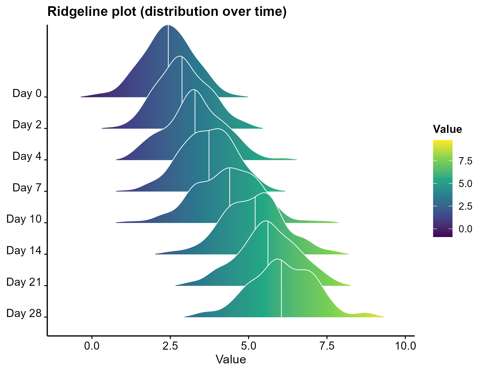

# 513 · Ridgeline plot (joyplot)

Stacks many group distributions as overlapping density ridges — ideal for showing how a
distribution **drifts across an ordered factor** (time, stage, pseudotime bin, cell
type). More compact than side-by-side violins and far richer than a bar chart.

| | |
|---|---|
| Language / deps | R · `ggplot2` `ggridges` (+ shared `theme_pub.R`) |
| Purpose | Distribution shift across many ordered groups |
| Input | `--input data.csv` (`group,value`); else synthetic |
| Output | `results/group_summary.csv`; `assets/ridgeline.png` |

## Method

`ggridges::geom_density_ridges_gradient` with viridis fill mapped to value and median
quantile lines. Groups are ordered top-to-bottom by the input factor order.

## Input

`data.csv` with `group`, `value`. Demo: 8 timepoints (Day 0–28) with rightward-drifting
distributions, generated on first run.

## Use

Time-course or trajectory distributions (expression / score / abundance over
stage/pseudotime), GWAS effect-size distributions across annotations, etc.

## Outputs

| File | Type | Description |
|------|------|------|
| `results/group_summary.csv` | table | median + IQR per group |
| `assets/ridgeline.png` | ridgeline | gradient density ridges with median lines |



## Run

```bash
Rscript 513_ridgeline_plot.R
Rscript 513_ridgeline_plot.R --input data.csv
```

## Dependencies

```r
install.packages(c("ggplot2","ggridges"))
```
