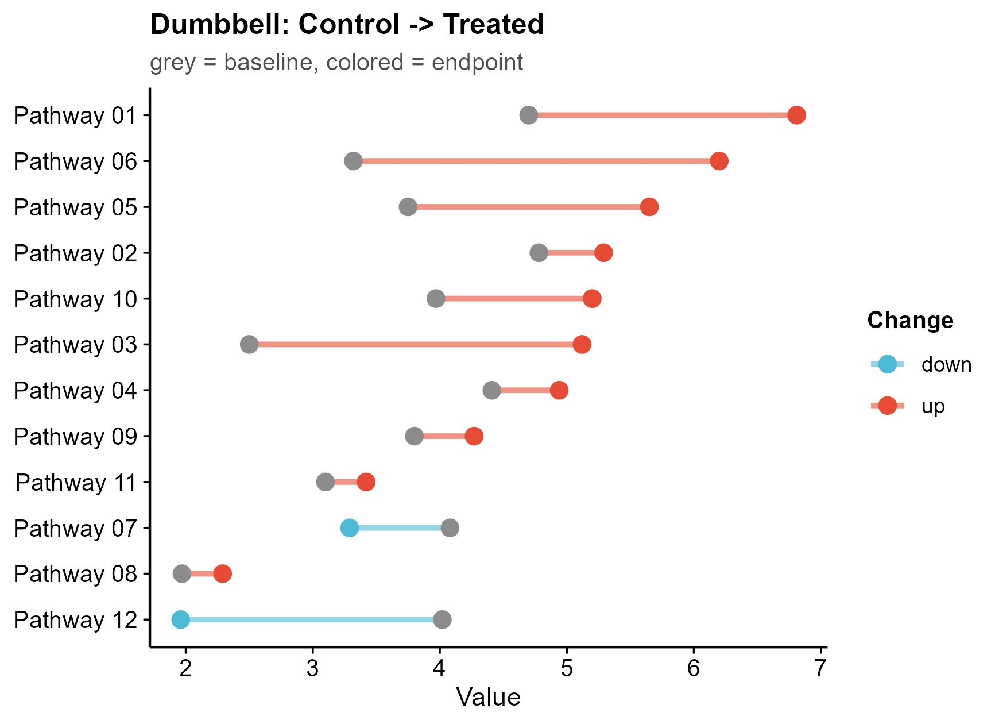

# 514 · Dumbbell & slopegraph (paired-change plots)

Two journal-standard ways to show **paired change** across many items without grouped
bar charts: the **dumbbell** (two endpoints joined by a segment, sorted, coloured by
direction) and the **slopegraph** (lines between two timepoints that reveal rank
crossings).

| | |
|---|---|
| Language / deps | R · `ggplot2` `ggrepel` (+ shared `theme_pub.R`) |
| Purpose | Before/after or two-condition comparison across items |
| Input | `--input data.csv` (`item,cond1,cond2`); else synthetic |
| Output | `results/paired_change.csv`; `assets/dumbbell.png`, `assets/slopegraph.png` |

## Method

Per item the two condition values are plotted as connected points (dumbbell) and as a
line between two x positions (slopegraph); colour encodes up/down direction, items are
ordered by endpoint.

## Input

`data.csv` with `item`, and two value columns (default `Control`, `Treated`). Demo: 12
pathways measured in two conditions, generated on first run.

## Use

Treatment before/after pathway scores, two-cohort effect sizes, two-timepoint cell
abundances — anywhere a grouped/clustered bar chart would otherwise be used.

## Outputs

| File | Type | Description |
|------|------|------|
| `results/paired_change.csv` | table | per-item values, delta, direction |
| `assets/dumbbell.png` | dumbbell | endpoints + connector, coloured by direction |
| `assets/slopegraph.png` | slopegraph | two-timepoint lines with labels |



## Run

```bash
Rscript 514_dumbbell_slope_plot.R
Rscript 514_dumbbell_slope_plot.R --input data.csv
```

## Dependencies

```r
install.packages(c("ggplot2","ggrepel"))
```
