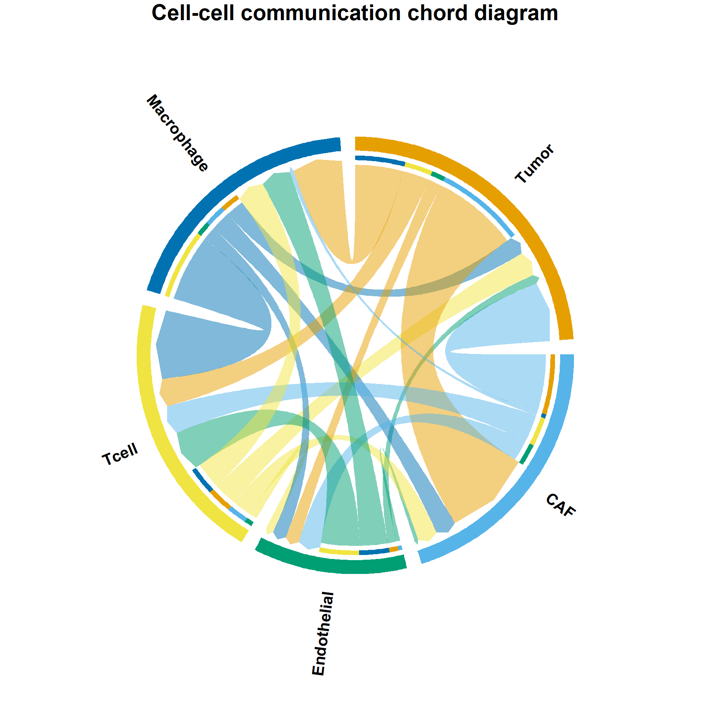

# 515 · Chord diagram (circular relationship plot)

Renders a source × target strength matrix as a circular **chord diagram** with directional
arrows — ideal for cell–cell communication strength, ligand–receptor flow, cluster gene
sharing, or state transitions. Surfaces the dominant relationships far better than a
stacked bar chart or adjacency table.

| | |
|---|---|
| Language / deps | R · `circlize` (+ shared `theme_pub.R` palette) |
| Purpose | Circular visualisation of directed relationships/flows |
| Input | `--input matrix.csv` (source rows × target cols); else synthetic |
| Output | `results/interaction_flows.csv`; `assets/chord_diagram.png` |

## Method

`circlize::chordDiagram` with `directional=1`, big-arrow link ends, Okabe-Ito sector
colours, and clockwise sector labels. The canvas is expanded to ±1.25 so long sector
names are not clipped. Base-graphics output is exported to **both** vector PDF and 300-dpi
PNG by the module itself.

## Input

`matrix.csv` — a square/rectangular matrix, first column = source names, header = target
names, cells = interaction strength. Demo: synthetic 5×5 tumour-microenvironment
cell–cell interaction matrix, generated on first run.

## Use

Visualise CellChat/CellPhoneDB aggregated interaction counts, ligand→receptor flows,
or any directed weighted relationship between a manageable set of categories (≈3–15).

## Outputs

| File | Type | Description |
|------|------|------|
| `results/interaction_flows.csv` | table | source, target, strength (ranked) |
| `assets/chord_diagram.png` | chord | directed circular relationship plot |



## Run

```bash
Rscript 515_chord_diagram.R
Rscript 515_chord_diagram.R --input matrix.csv
```

## Dependencies

```r
install.packages("circlize")
```
