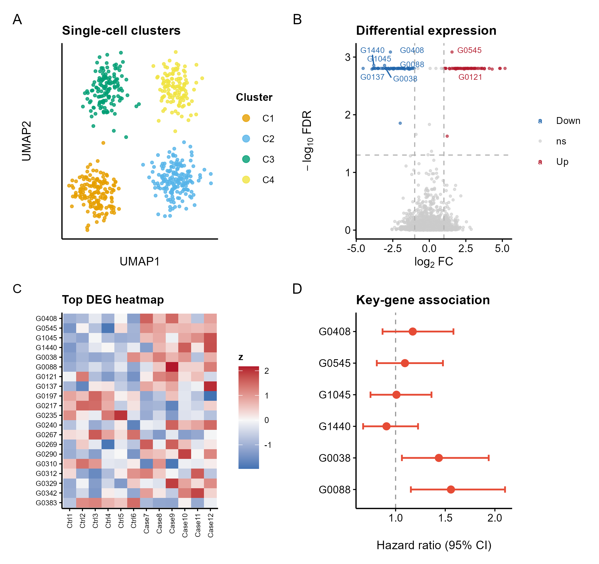

# 516 · Composite multi-panel figure ("Figure 1")

A template for assembling several plot types into one publication-grade composite with
A/B/C/D panel tags — the way a journal "Figure 1" is built. Panels: **A** UMAP clusters,
**B** volcano (DEG), **C** top-DEG heatmap (row z-score), **D** key-gene effect forest.
Also serves as the "volcano + heatmap combo" template.

| | |
|---|---|
| Language / deps | R · `ggplot2` `ggrepel` `patchwork` (+ shared `theme_pub.R`) |
| Purpose | Native multi-panel composite (no stretched raster pasting) |
| Input | fully synthetic (self-contained demo) |
| Output | `results/deg_significant.csv`; `assets/composite_figure1.png` |

## Method

Each panel is a standalone `ggplot` built with the shared `theme_pub()`; `compose_panels()`
(patchwork) lays them out 2×2 and adds bold A/B/C/D tags. Panels are composed **natively**
(no pre-rendered PNGs stretched to a wrong aspect — the failure this template avoids), so
the export is a clean editable vector PDF + 300-dpi PNG.

## Use

Drop-in scaffold for your own Figure 1: replace each panel's data block with your UMAP /
DEG / heatmap / association results. The volcano (B) + heatmap (C) pair alone is the common
"DEG overview" combo. Single panels can also be exported separately for flexible layout.

## Outputs

| File | Type | Description |
|------|------|------|
| `results/deg_significant.csv` | table | significant DEGs from the volcano panel |
| `assets/composite_figure1.png` | composite | 4-panel A/B/C/D figure (UMAP/volcano/heatmap/forest) |



## Run

```bash
Rscript 516_composite_multipanel.R
```

## Dependencies

```r
install.packages(c("ggplot2","ggrepel","patchwork"))
```
