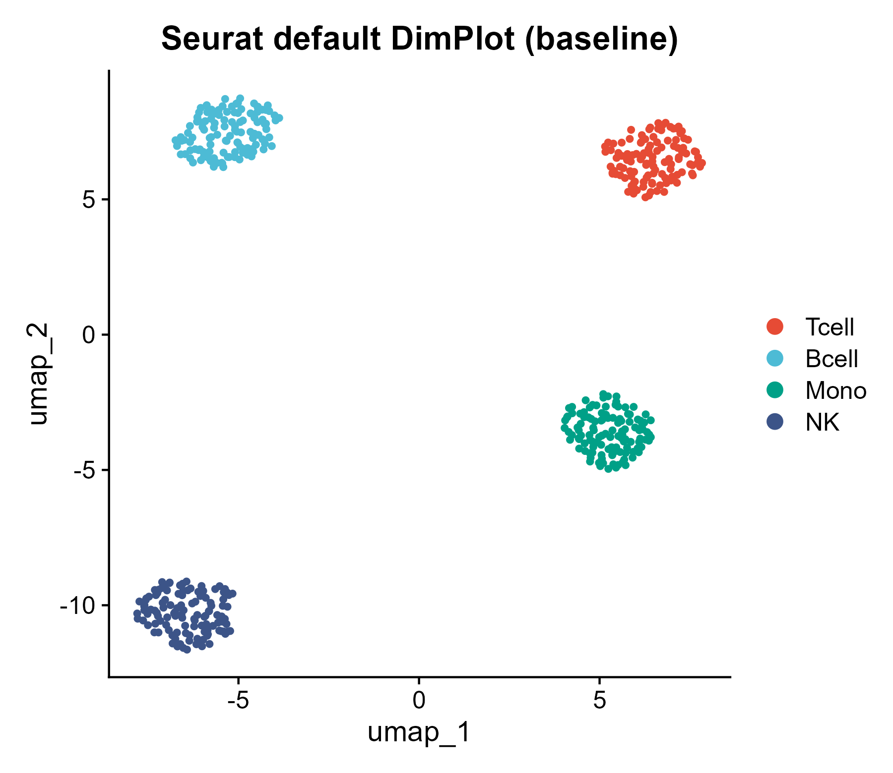
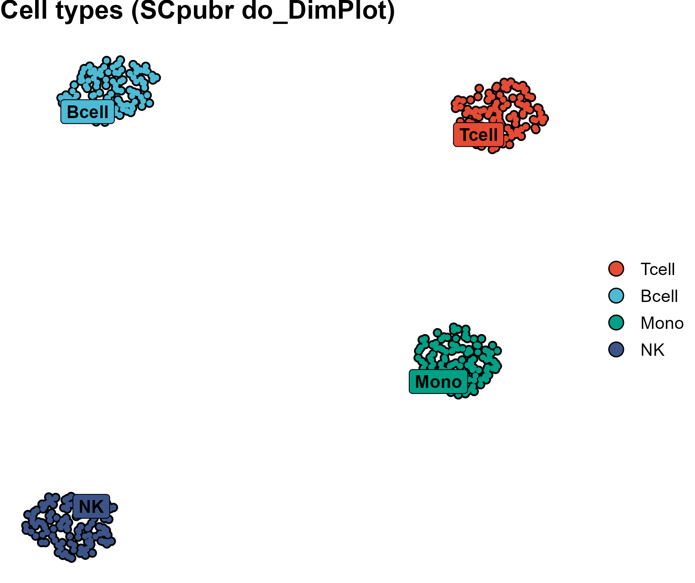
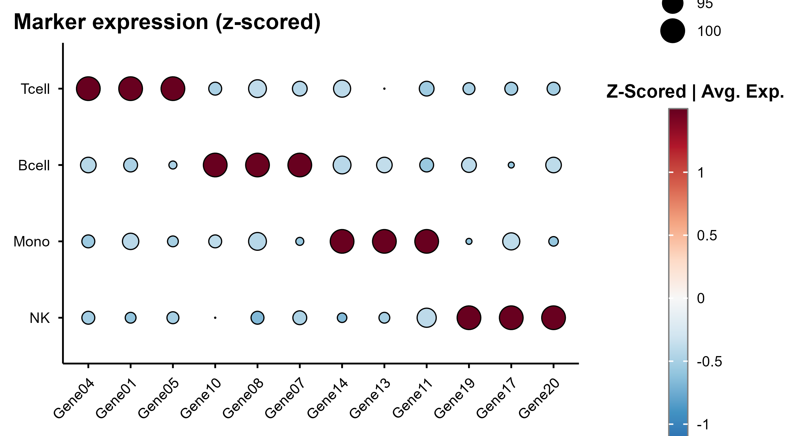
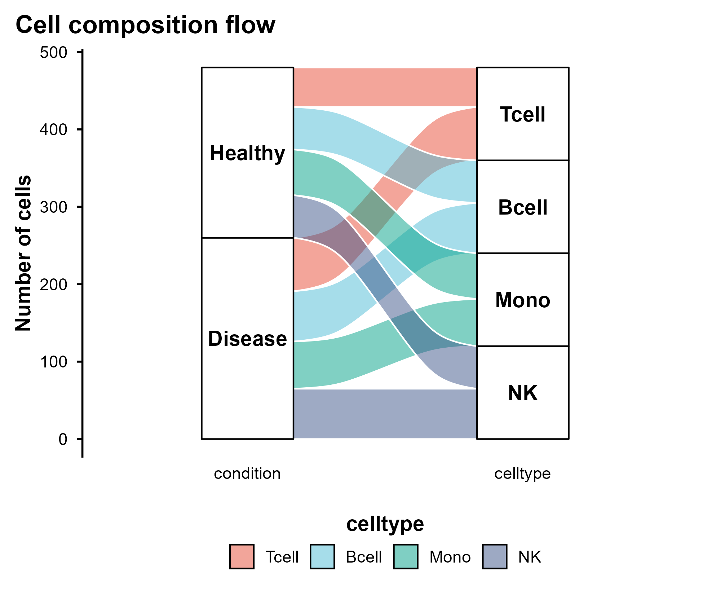
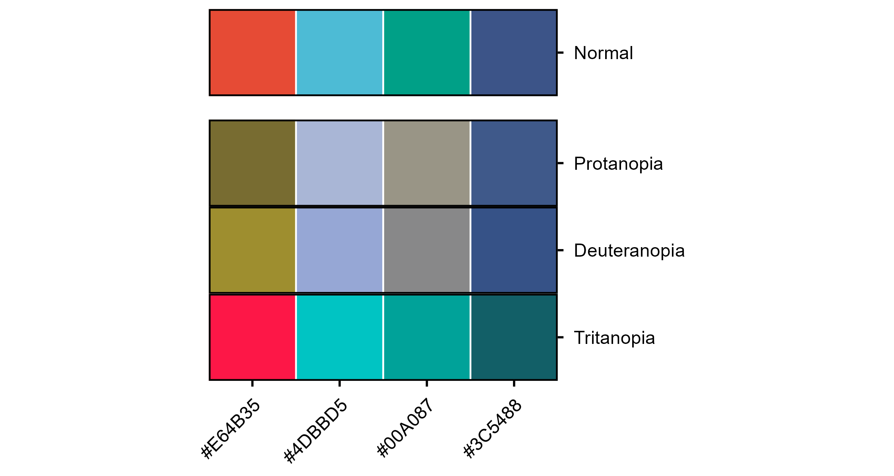

<!-- 图中文字英文,正文中文 -->

# 532 · SCpubr 单细胞出版级图一键出 SCpubr Publication Figures

> 一句话定位:输入**一个 Seurat 对象** → 用 **SCpubr(v3.x)** 一键出 UMAP / 点图 / 表达图 / 小提琴 / 桑基 + 色盲安检 → 出**统一顶刊审美、色盲友好**的成套图。

| | |
|---|---|
| **语言 / 主依赖** | R · `SCpubr`(≥3.0) `Seurat` `ggplot2` |
| **一句话用途** | 把各包简陋默认单细胞图标准化为刊级、色盲安全的成套图 |
| **输入** | `example_data/synthetic_seurat.rds`(脚本首跑自动生成的合成 Seurat 对象) |
| **输出** | `results/`(摘要表、依赖快照) · 展示图见 `assets/` |

---

## ① 输入数据

**文件**:`synthetic_seurat.rds`(类型:RDS 序列化的 `Seurat` 对象;首跑自动生成,`synthetic, for demo only`)

对象须满足(真实数据替换时同样要求):

| 内容 | 必需 | 说明 |
|------|:---:|------|
| 表达矩阵 + `data` layer | ✔ | 标准 `NormalizeData` 后的归一化表达(点图/小提琴/表达图用) |
| UMAP 降维 `Reductions(so)` 含 `umap` | ✔ | `do_DimPlot`/`do_FeaturePlot` 的散点坐标 |
| 元数据列 `celltype` | ✔ | 细胞类型(`--celltype` 指定列名);分组/着色用 |
| 元数据列 `condition` | ✖ | 分组条件(`--condition`);用于 split UMAP 与桑基流向图 |

**命名/格式约定**:`--celltype` / `--condition` 必须是 `so@meta.data` 中真实存在的列名;留 `--input` 为空则脚本生成合成对象(4 类细胞 Tcell/Bcell/Mono/NK,各 5 个特异 marker,2 个条件)。

**样例**:合成对象 480 细胞 × 80 基因,4 类细胞,每类前若干基因为该类特异高表达 marker(出图后点图呈块对角,验证数据与流程正确)。

## ② 方法 / 原理 与 ★诚实基线

- **方法**:SCpubr(Blanco-Carmona, 2022, *bioRxiv*;CRAN `SCpubr`)是 Seurat 生态的**出图封装层**,对 `do_DimPlot / do_DotPlot / do_FeaturePlot / do_ViolinPlot / do_AlluvialPlot / do_ColorBlindCheck` 统一施加刊级排版(细胞描边、on-plot 标签、去网格、viridis/发散连续标尺)与**色盲友好默认配色**。本脚本按类挑 marker(每类 top-3 平均表达;真实数据应换 `FindAllMarkers`),用 NPG 离散配色出 8 张图。
- **★诚实基线(必读)**:本模块是**出图/审美标准化工具,不是分析方法**。它**不改变**底层聚类、UMAP 坐标或表达值,**只替换**各包的简陋默认图(`Seurat::DimPlot` 灰底彩点、默认 DotPlot 主题)为统一刊级版本。
  - 脚本同时画 **Seurat 默认 UMAP** 作为对照(`assets/00_baseline_seurat_default_umap.png`),可与 `01_scpubr_umap_celltype.png` 并排目检——**同一份数据、同一份聚类**,差异纯在可读性/排版/色盲安全。
  - 诚实地说:它提升的是**投稿通过率与可读性**,不产生新生物学结论。审美与本库 `theme_pub` 一致(同 NPG 离散板)。
  - `do_ColorBlindCheck` 进一步把所用配色在 **protan/deutan/tritan 三型色盲**下模拟,实测 NPG 4 色在三型下仍可区分(见图 07)。

## ③ 用途

- 单细胞论文成图阶段:UMAP 注释图、marker 点图、表达图、分布小提琴、细胞组成流向(桑基)一次成套出齐,审美统一。
- 投稿前**色盲合规自检**:用 `do_ColorBlindCheck` 证明配色在色觉障碍读者下仍可读(部分期刊已要求)。

## ④ 特点 / 亮点

- **turnkey**:`Rscript 532_scpubr_publication_figures.R` 零改动即跑,自动生成合成 Seurat 对象;
- **真包实跑**:全部图由 SCpubr 3.0.1 真实渲染(非 stub);
- **内置诚实基线**:Seurat 默认 UMAP 对照图,明确"标准化前后"差异仅在审美;
- **禁平凡条形图**:全部为点图 / 小提琴 / 桑基 / UMAP 散点等高级图;
- **色盲友好**:NPG 配色 + 三型色盲模拟安检;
- 每图独立成 PDF+PNG,路径全相对,固定种子(42),末尾落 `sessionInfo`。

## ⑤ 输出结果图

| 文件 | 图型 | 说明 |
|------|------|------|
| `assets/00_baseline_seurat_default_umap.png` | UMAP 散点(基线) | ★诚实对照:Seurat 默认 DimPlot |
| `assets/01_scpubr_umap_celltype.png` | UMAP 散点 | SCpubr do_DimPlot,细胞描边 + on-plot 标签 |
| `assets/02_scpubr_umap_split_condition.png` | UMAP 分面 | 按条件 split 的 UMAP |
| `assets/03_scpubr_dotplot_markers.png` | 点图(dot) | marker z-score 点图(呈块对角,验证正确) |
| `assets/04_scpubr_featureplot.png` | UMAP 表达图 | viridis 精修表达,非灰红 |
| `assets/05_scpubr_violin.png` | 小提琴 + 箱线 | marker 表达分布 |
| `assets/06_scpubr_alluvial_flow.png` | 桑基(alluvial) | condition → celltype 细胞组成流向 |
| `assets/07_scpubr_colorblind_check.png` | 色板模拟 | 三型色盲安检 |

**基线对照(左 Seurat 默认 / 右 SCpubr 刊级)——同一数据,仅审美不同:**

| Seurat 默认(基线) | SCpubr 刊级 |
|---|---|
|  |  |

**marker 点图(块对角验证数据/流程正确):**



**细胞组成流向桑基 + 色盲安检:**

| 桑基流向 | 三型色盲安检 |
|---|---|
|  |  |

---

## 运行

```bash
# 零改动跑示例(自动生成合成 Seurat 对象)
Rscript 532_scpubr_publication_figures.R

# 换成自己的 Seurat 对象(.rds 须含 UMAP 降维 + 元数据列)
Rscript 532_scpubr_publication_figures.R --input my_seurat.rds --celltype celltype --condition condition
```

## 依赖安装

```r
install.packages(c("SCpubr", "Seurat", "ggplot2"))
# SCpubr 部分功能可选装:  install.packages(c("colorspace", "ggalluvial", "scales"))
```
