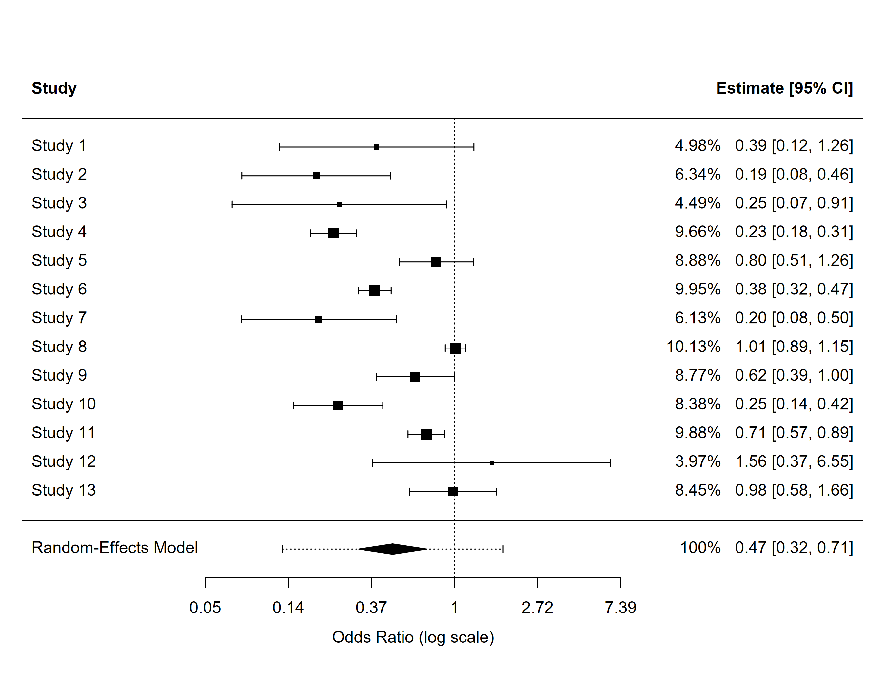
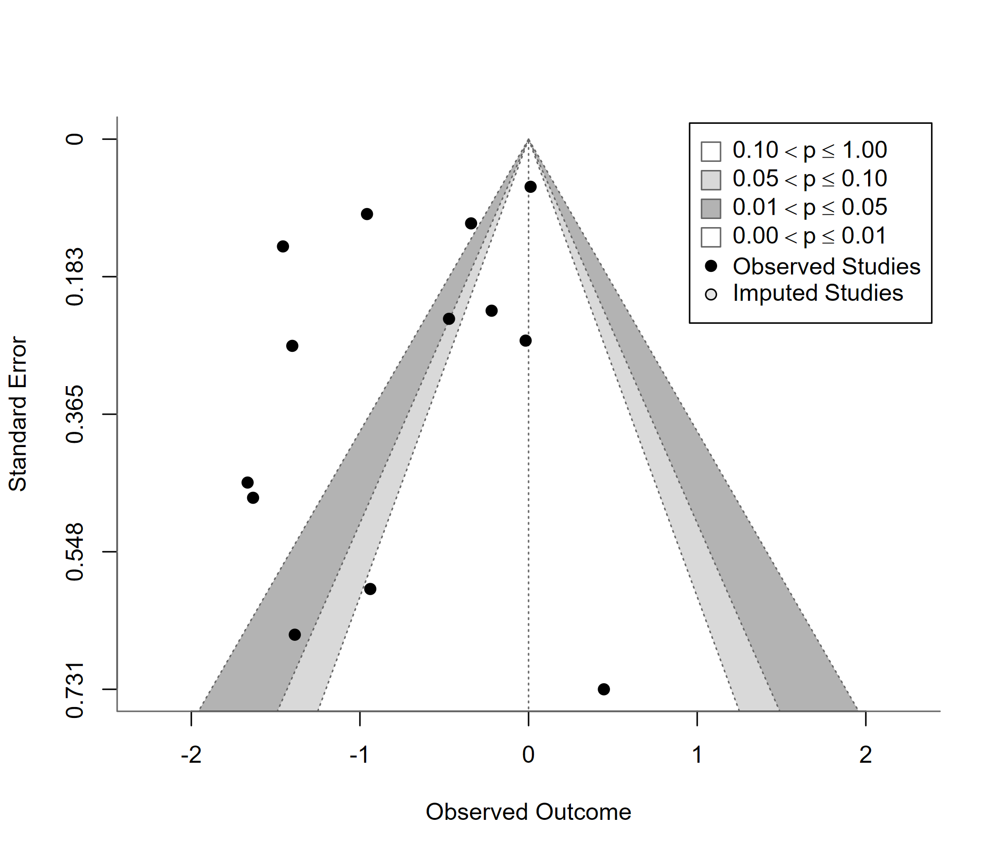

# 597 · 证据合成 / 系统评价 Meta 分析(multi-method toolkit 演示)

> 一句话定位:输入 2×2 计数试验数据 → 随机效应合并(REML + Knapp-Hartung)、异质性、亚组 / meta 回归、发表偏倚、影响诊断 → 森林图与漏斗图。统计全部由随模块捆绑的 **meta-analysis-toolkit 函数库**(`toolkit/R`,wrap `metafor`/`meta`/`netmeta`/`mada`/`bayesmeta`/`robvis`/`metasens`)完成,本脚本只做 I/O 与展示。

| | |
|---|---|
| **语言 / 主依赖** | R · `metafor`(核心),`meta` `metadat` `mada` `bayesmeta` `robvis` `metasens`(进阶模块) |
| **一句话用途** | 二分类结局(2×2 计数)的完整 meta 分析 + 发表级森林图 / 漏斗图,方法学默认值对齐 PRISMA 2020 / Cochrane / GRADE 预期 |
| **输入** | `example_data/bcg_trials.csv`(13 个 BCG 疫苗随机对照试验,2×2 计数) |
| **输出** | `results/`(运行生成:4 个汇总表 + 7 张矢量 PDF + sessionInfo) · 展示图见 `assets/` |

---

## ① 输入数据

**文件**:`bcg_trials.csv`(类型:csv;orientation:行 = 研究;列 = 计数与调节变量;真实数据,来源 `metadat::dat.bcg`,经典 BCG 结核疫苗试验集)

| 列名 | 类型 | 必需 | 示例 | 说明 |
|------|------|:---:|------|------|
| `author` | str | ✅ | `Aronson` | 研究作者(用于森林图标签) |
| `year` | int | ✅ | `1948` | 发表年份 |
| `tpos` | int | ✅ | `4` | 治疗组事件数 |
| `tneg` | int | ✅ | `119` | 治疗组非事件数 |
| `cpos` | int | ✅ | `11` | 对照组事件数 |
| `cneg` | int | ✅ | `128` | 对照组非事件数 |
| `ablat` | int | 可选 | `44` | 纬度绝对值(连续调节变量,meta 回归) |
| `alloc` | str | 可选 | `random` | 分配隐藏方式(分类调节变量,亚组) |

**命名 / 格式约定**:无(2×2 计数列名固定为 `tpos/tneg/cpos/cneg`)。

**示例(前 3 行)**:
```
"author","year","tpos","tneg","cpos","cneg","ablat","alloc"
"Aronson",1948,4,119,11,128,44,"random"
"Ferguson & Simes",1949,6,300,29,274,55,"random"
```

## ② 方法 / 原理

完整流水线(`toolkit/R` 函数库,薄封装、不重复造轮子,每个函数都有真实数据测试):

1. **效应量**:`ma_pairwise()` 由 2×2 计数计算 log OR(或 SMD / ZCOR / lnRR 等),支持数据准备转换(`dp_*`,如中位数→均值、CI→SD)。
2. **合并**:随机效应 `metafor::rma(yi, vi)`,默认 REML + Knapp-Hartung 校正 + 95% 预测区间(报告 τ²、I²、H²、Cochran's Q);同时拟合固定效应模型对照。
3. **异质性**:`ma_subgroup()`(混合效应 Q_M 亚组间检验 + 每亚组独立合并)与 `ma_metareg()`(调节变量回归 + bubble plot + pseudo-R²)。
4. **发表偏倚**:`ma_pubbias()`(Egger 回归、Begg 秩相关、trim-and-fill、PET-PEESE 条件校正;k < 10 时按 Sterne 2011 警告不可靠)+ `ma_funnel()` 等高线漏斗图。
5. **影响诊断**:`ma_influence()`(leave-one-out、Baujat、累计森林图、GOSH 子集云、Cook 距离等案例删除诊断)。
6. **出图**:`ma_forest()`(含预测区间菱形与权重列)、`ma_drapery()`;进阶能力见函数库:`07_grade`(GRADE 确定性 + SoF 表)、`08_prisma`(PRISMA 2020 流程图)、`09_rob`(RoB 2 / ROBINS-I 交通灯)、`20_network_meta`(NMA)、`21_diagnostic_meta`(DTA / SROC)、`22_bayesian_meta`(bayesmeta 贝叶斯)。

**方法学引用**(详见 `toolkit/docs/REFERENCES.md` 与 `toolkit/docs/TOP_JOURNAL_STANDARDS.md`):Viechtbauer 2010(metafor)、Röver 2020(bayesmeta)、Page et al. 2021(PRISMA 2020,BMJ 372:n71)、Guyatt 2011 / Balshem 2011(GRADE)、Sterne 2011(小样本偏倚检验适用条件)、Reitsma 2005(DTA 双变量模型)。

## ③ 用途

回答"多项研究是否回答同一估计目标、合并效应是多少、结论是否稳健、证据确定性如何"这类系统评价 / 证据合成问题。典型场景:干预效果 meta 分析(随机对照试验)、诊断准确性系统评价、网络 meta 分析、贝叶斯 meta 分析、GRADE 确定性分级、PRISMA 报告。函数库是通用的,可直接在任意 meta 分析项目里 `source()` 复用(本模块演示了核心二分类工作流)。

## ④ 特点 / 亮点

- **函数库随模块捆绑**(`toolkit/`,来自原独立仓库 meta-analysis-toolkit,commit `3af629d`,MIT 许可;**2026-08 已并入本库**,原仓库不再单独维护):R 模块 00–30 共 25 个文件、约 60 个函数,`source()` 即用,不重实现任何统计(全部 wrap 同行评审估计量)。
- **turnkey**:`Rscript 597_meta_analysis_toolkit.R` 零改动跑通;换数据用 `--input/--outdir`。
- **顶刊默认值**:REML + Knapp-Hartung、预测区间、轮廓似然 I² 区间、trim-and-fill、PET-PEESE——Cochrane / PRISMA 2020 / GRADE 评审预期齐备;不设 I² 阈值自动决定合并(按 SKILL 规范人工判断)。
- **可复现**:固定随机种子、每次运行自动写 `results/597_sessionInfo.txt` 依赖快照。
- 本模块演示了「二分类 → 森林图」的完整主链路;网络 / 诊断准确性 / 贝叶斯 / GRADE / PRISMA / RoB 等完整方法见函数库 `toolkit/examples/run_all_examples.R`(一键重跑全部示例,生成 `figures/` 与 `tables/`)。

## ⑤ 输出结果图

| 文件 | 图型 | 说明 |
|------|------|------|
| `assets/597_forest.png` | Forest · 森林图 | 13 个 BCG 试验的 OR 森林图(REML+KH,含预测区间) |
| `assets/597_funnel.png` | Funnel · 漏斗图 | 等高线漏斗图(90/95/99%)+ trim-and-fill 校正 |





**运行结果摘要**(本机 R 4.4.3 实测,`example_data/bcg_trials.csv`):合并 OR = 0.475(95% CI 0.316–0.713,预测区间 0.126–1.795,p = 0.0018),I² = 92.1%,τ² = 0.338;meta 回归显示纬度 `ablat` 显著解释异质性(Q_M = 25.24,p = 5.1e-07,pseudo-R² = 85.1%),与经典 BCG 文献结论一致(纬度越高疫苗效果越强);Egger p = 0.16、trim-and-fill 未补插(k0 = 0),未提示小样本偏倚。详见 `results/597_*.csv`。

---

## 运行

```bash
# 零改动跑示例
Rscript 597_meta_analysis_toolkit.R
# 换自己的数据(格式同上,含 tpos/tneg/cpos/cneg 列)
Rscript 597_meta_analysis_toolkit.R --input data/your.csv --outdir results/run1
# 一键重跑函数库全部示例(生成 figures/ 与 tables/,需先 cd 到 toolkit/)
Rscript toolkit/examples/run_all_examples.R
```

## 依赖安装

```r
# core(必需)
install.packages(c("metafor", "meta", "netmeta", "metadat"))
# 进阶模块 + 辅助
install.packages(c("mada", "bayesmeta", "robvis", "metasens", "estmeansd"))
```

> 数据来源说明:示例数据 `bcg_trials.csv` 为 `metadat` 包捆绑的 `dat.bcg` 真实数据(13 个试验),非合成;用于函数库验证与展示,可复现。
