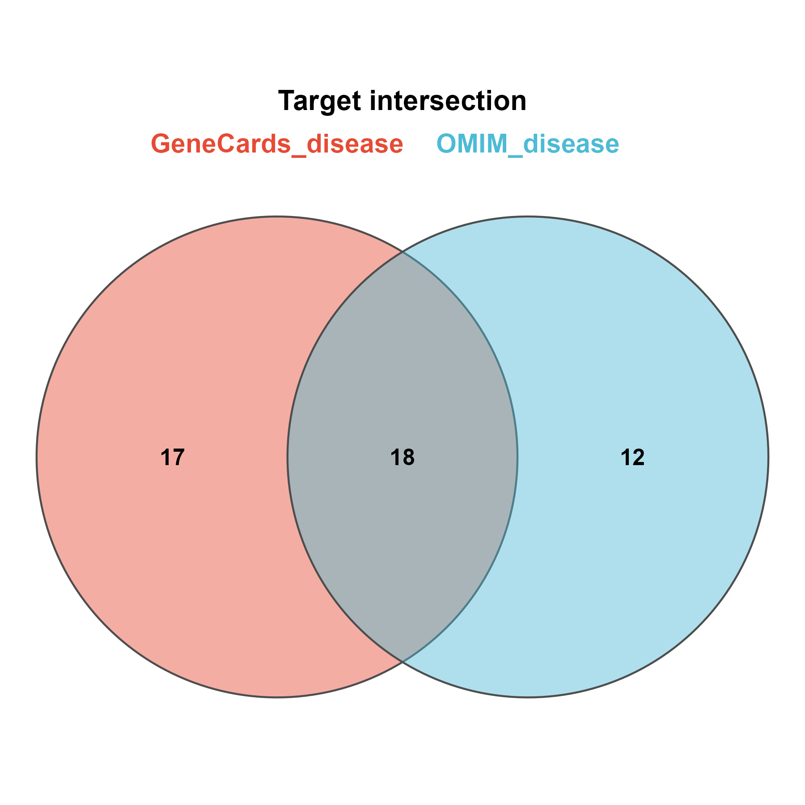

# 005 · OMIM ∩ GeneCards 疾病靶点 Venn

> 多份疾病靶点列表(OMIM / GeneCards) → 一条命令 → 交集/并集 + Venn + 集合柱状图。

| | |
|---|---|
| **语言 / 主依赖** | R · `theme_pub` + `UpSetR` |
| **输入** | `example_data/`(OMIM + GeneCards 疾病靶点 csv) |
| **输出** | `results/` 交并集表 + `assets/` 图 |

## ① 输入数据
`--input` 目录,内含 ≥2 份疾病靶点列表(csv;自动识别 `Gene`/首列)。

## ② 方法 / 原理
集合并集/交集 → `venn_pub` + 集合大小柱状图 + UpSet。与 [003](../003_CTD_Swiss靶点并集Venn/) 同引擎。

## ③ 用途
合并多疾病靶点数据库,得到疾病相关基因全集/高置信集,供与化合物靶点取交(→006)。

## ④ 特点 / 亮点
Turnkey;零依赖 Venn;自动识别基因列。

## ⑤ 输出结果图
`assets/Target_Venn.png`(Venn)· `assets/Set_size_bar.png`(集合大小)



## 运行
```bash
Rscript 005_disease_target_venn.R
```
依赖:`install.packages("UpSetR")`
