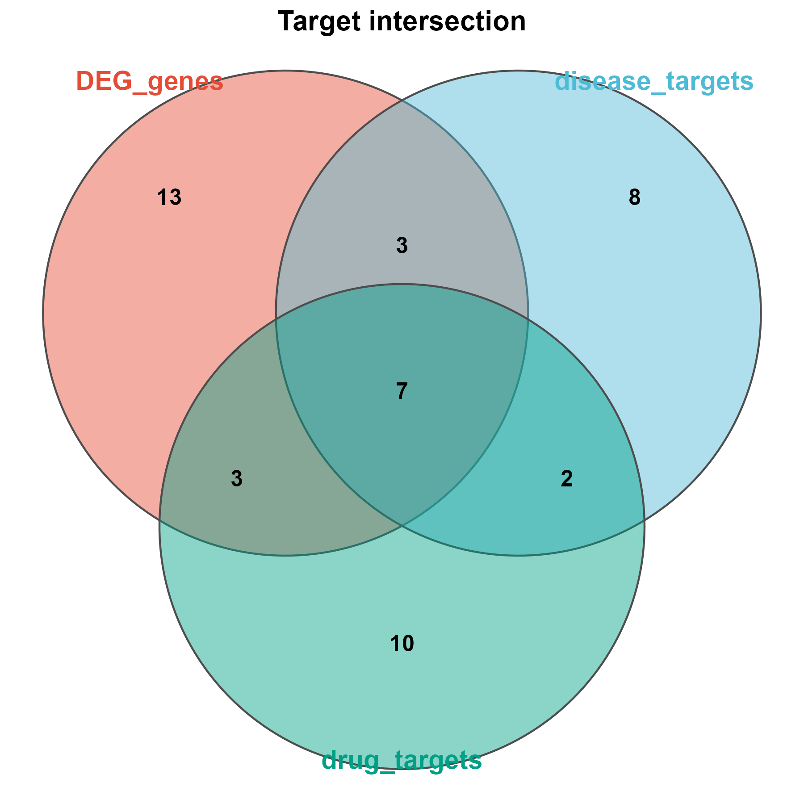

# 011 · 差异基因 × 药物靶点交集 Venn / UpSet

> 差异基因 + 药物靶点 + 疾病靶点 → 一条命令 → 多集交集 + Venn + UpSet。

| | |
|---|---|
| **语言 / 主依赖** | R · `theme_pub` + `UpSetR` |
| **输入** | `example_data/`(DEG / drug / disease 三份列表) |
| **输出** | `results/` 交集表 + `assets/` 图 |

## ① 输入数据
`--input` 目录,含多份基因/靶点列表(csv;自动识别 `Gene`/首列)。≥3 集时额外出 UpSet。

## ② 方法 / 原理
求多集交集(DEG ∩ 药物靶点 ∩ 疾病靶点)→ `venn_pub`(3集)+ UpSet + 集合柱状图。

## ③ 用途
锁定既差异表达、又是药物靶点、又与疾病相关的核心基因,作为机制研究/成药候选。

## ④ 特点 / 亮点
Turnkey;3 集 Venn + UpSet 双视图;零依赖 Venn。

## ⑤ 输出结果图
| 文件 | 图型 |
|------|------|
| `assets/Target_Venn.png` | 3 集 Venn |
| `assets/Target_UpSet.png` | UpSet |
| `assets/Set_size_bar.png` | 集合大小 |



## 运行
```bash
Rscript 011_DEG_drug_target_venn.R
```
依赖:`install.packages("UpSetR")`
