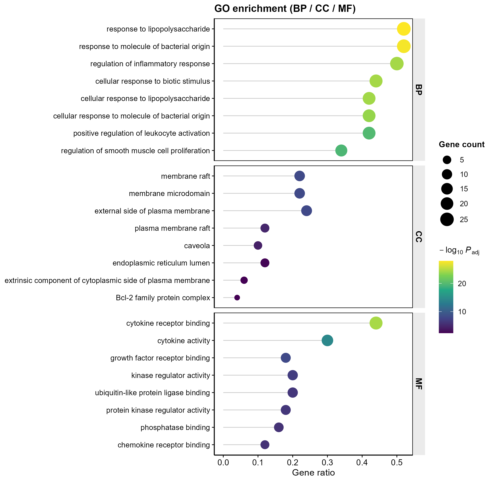

# 007 · GO / KEGG 富集分析 — GO & KEGG Enrichment

> 输入一组候选基因 → 一条命令 → 输出 GO(BP/CC/MF)与 KEGG 通路富集表 + 顶刊级独立图(三本体点图、KEGG 棒棒糖、基因–通路网络)。

| | |
|---|---|
| **语言 / 主依赖** | R · `clusterProfiler` `org.Hs.eg.db` `DOSE` `ggplot2` `ggraph` |
| **一句话用途** | 把基因列表注释到 GO 功能与 KEGG 通路,定位富集的生物学过程 |
| **输入** | `example_data/gene_list.csv`(单列基因) |
| **输出** | `results/` 表格+图 · 展示图见 `assets/` |

---

## ① 输入数据

**文件**:`gene_list.csv`(csv;每行一个基因)

| 列名 | 类型 | 必需 | 示例 | 说明 |
|------|------|:---:|------|------|
| `Gene` | str | ✔ | `TP53` | 人类基因 Symbol(默认);也可传 ENTREZ ID 并加 `--keytype ENTREZID` |

**命名/格式约定**:单列即可,列名为 `Gene`(若非此名,默认取第一列)。物种默认人类;换物种改 `--organism` 并替换 OrgDb。

**样例(前 3 行)**:
```
Gene
TNF
IL6
```

## ② 方法 / 原理

1. **基因 ID 转换**:`clusterProfiler::bitr()` 经 `org.Hs.eg.db` 把 Symbol → ENTREZID。
2. **GO 富集**:`enrichGO(ont="ALL")` 对 BP/CC/MF 三本体做超几何检验 + BH 校正(离线,本地注释库)。
3. **KEGG 富集**:`enrichKEGG()` 查询 KEGG 在线通路库(需联网;无网络自动跳过,不中断)。
4. **可视化**:结果经共享主题 `theme_pub.R` 重绘为期刊级图(viridis 配色、矢量导出)。

> 方法引用:Wu *et al.*, *The Innovation* 2021(clusterProfiler 4.0)。

## ③ 用途

回答"这批基因主要参与哪些**生物学过程/分子功能/细胞组分**与**信号通路**"。典型用于:差异基因/WGCNA 模块基因/机器学习特征基因/靶点交集基因的功能解读,是几乎所有组学分析的标配下游。

## ④ 特点 / 亮点

- **Turnkey**:零改动 `Rscript 007_GO_KEGG_enrichment.R` 即跑示例;`--input` 换数据即出图,无需改脚本。
- **顶刊级独立图**:三本体分面点图、KEGG 棒棒糖、基因–通路概念网络,各自独立成图便于拼版。
- **稳健**:KEGG 断网自动降级;ID 转换失败/无显著项均有提示不报错。
- **矢量可投稿**:每图同时输出可编辑 PDF 与 300dpi PNG。

## ⑤ 输出结果图

每张图**独立成文件**(矢量 PDF + 300dpi PNG),投稿时自行拼版。

| 文件 | 图型 | 说明 |
|------|------|------|
| `assets/GO_enrichment_dotplot.png` | 分面点图 | GO BP/CC/MF 各 top8,点大小=基因数,色=−log₁₀Padj |
| `assets/KEGG_enrichment_lollipop.png` | 棒棒糖图 | KEGG top 通路,色=−log₁₀Padj |
| `assets/GenePathway_network.png` | 概念网络 | top5 通路与其基因的二部网络,hub 异色 |
| `results/GO_results.csv` / `KEGG_results.csv` | 表 | 完整富集结果 |

GO 富集分面点图:


基因–通路概念网络:


---

## 运行

```bash
# 零改动跑示例
Rscript 007_GO_KEGG_enrichment.R
# 换成自己的数据 + 自定义参数
Rscript 007_GO_KEGG_enrichment.R --input data/my_genes.csv --outdir results/run1 --top 10 --padjust 0.05
```

可选参数:`--top`(每类展示数,默认 8)·`--pvalue`/`--padjust`(阈值,默认 0.05)·`--organism`(KEGG 物种,默认 hsa)·`--keytype`(SYMBOL/ENTREZID)。

## 依赖安装

```r
if (!require("BiocManager")) install.packages("BiocManager")
BiocManager::install(c("clusterProfiler","org.Hs.eg.db","DOSE"))
install.packages(c("ggplot2","dplyr","ggraph","tidygraph","ggrepel"))
```
