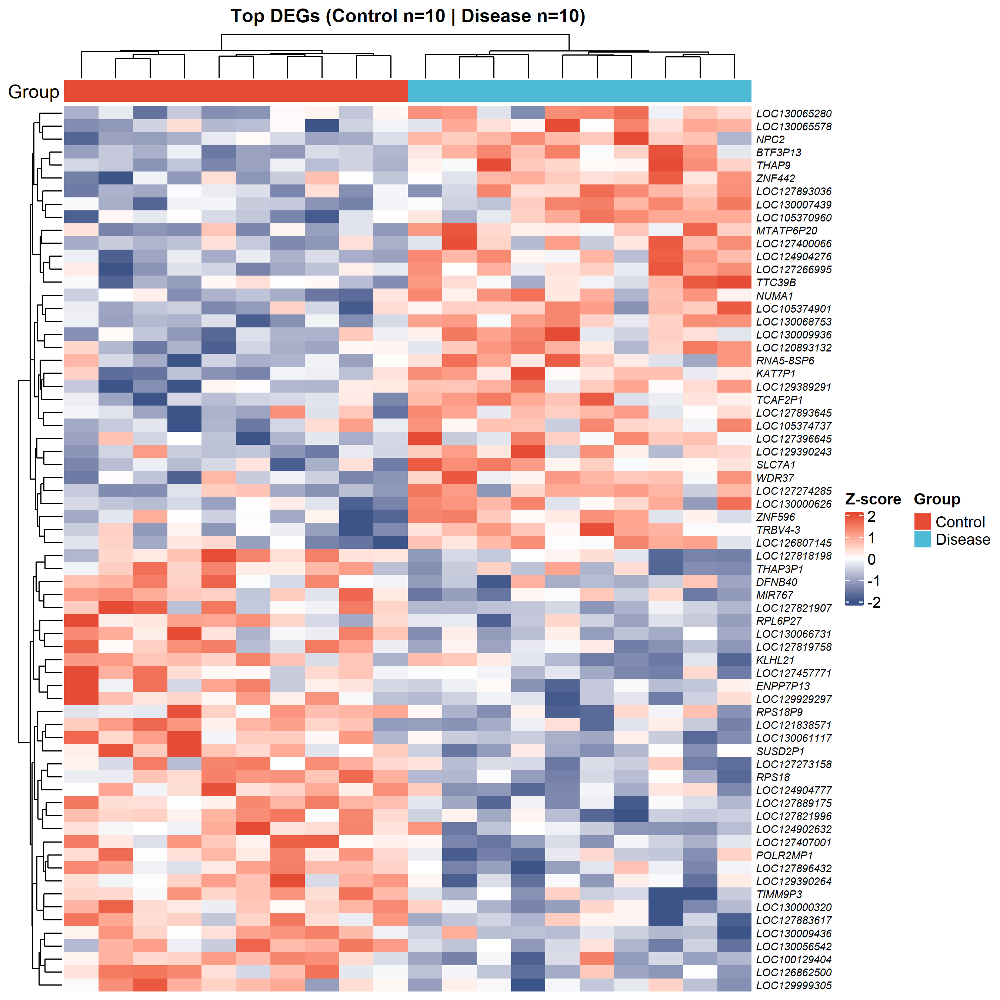

# 010 · GEO 差异表达分析 — 火山图 / 热图 / PCA

> 输入表达矩阵 → 一条命令 → limma 差异分析 + 顶刊级独立图(渐变火山图、PCA、DEG 聚类热图)。

| | |
|---|---|
| **语言 / 主依赖** | R · `limma` `ComplexHeatmap` `ggplot2` `ggrepel` |
| **一句话用途** | 两组转录组差异表达 + 标准三件套可视化 |
| **输入** | `example_data/expr_matrix.csv`(基因 × 样本) |
| **输出** | `results/` 表格+图 · 展示图见 `assets/` |

---

## ① 输入数据

**文件**:`expr_matrix.csv`(csv;行=基因,列=样本)

| 列 | 类型 | 必需 | 示例 | 说明 |
|------|------|:---:|------|------|
| 第 1 列(基因名) | str | ✔ | `TP53` | 设为行名 |
| 样本列 ×N | num | ✔ | `8.21` | 建议已 log2 归一化的表达值 |

**命名/格式约定**:样本列名后缀区分分组 —— 对照 `*_con`、实验 `*_tre`(可用 `--ctrl/--case` 改后缀)。每组建议 ≥3 重复。

**样例**:
```
Gene,S01_con,...,S01_tre,...
NUMA1,8.10,...,10.32,...
```

## ② 方法 / 原理

`limma`:`lmFit` 线性模型 → `makeContrasts(Disease−Control)` → `eBayes` 经验贝叶斯 → `topTable`(BH/FDR 校正)。按 `|log2FC|>阈值 & FDR<阈值` 取显著 DEG。PCA 用 `prcomp`(标准化)。热图用 `ComplexHeatmap`(行 z-score 标准化 + 双向聚类)。

> 方法引用:Ritchie *et al.*, *NAR* 2015(limma);Gu *et al.*, *Bioinformatics* 2016(ComplexHeatmap)。

## ③ 用途

GEO/RNA-seq 两组对比(疾病 vs 对照、处理 vs 未处理)的标准差异表达流程,产出下游富集(→007)、机器学习特征(→04 类)、诊断模型(→05 类)所需的 DEG 列表。

## ④ 特点 / 亮点

- **Turnkey**:零改动跑示例;`--input` 换数据即出图;分组后缀、阈值、标注数全可调。
- **顶刊级火山图**:logFC 渐变着色 + 显著性映射点大小 + top 基因斜体标注 + 上下调计数。
- **稳健**:自动检测分隔符;分组后缀缺失/无显著基因均有明确提示。
- **矢量**:每图 PDF + 300dpi PNG。

## ⑤ 输出结果图

每张图独立成文件(PDF + PNG)。

| 文件 | 图型 | 说明 |
|------|------|------|
| `assets/DEG_volcano.png` | 渐变火山图 | top 上/下调基因斜体标注 |
| `assets/DEG_PCA.png` | PCA 散点 | 95% 置信椭圆,组间分离 |
| `assets/DEG_heatmap.png` | 聚类热图 | top DEG × 样本,分组注释 |
| `results/DE_results.csv` · `DE_significant_genes.csv` | 表 | 全部 / 显著 DEG |




---

## 运行

```bash
Rscript 010_GEO_DEG_volcano_heatmap_PCA.R                          # 跑示例
Rscript 010_GEO_DEG_volcano_heatmap_PCA.R --input data/expr.csv --logfc 1 --padj 0.05 --topn 20
```

## 依赖安装

```r
if (!require("BiocManager")) install.packages("BiocManager")
BiocManager::install(c("limma","ComplexHeatmap"))
install.packages(c("ggplot2","ggrepel","circlize"))
```
