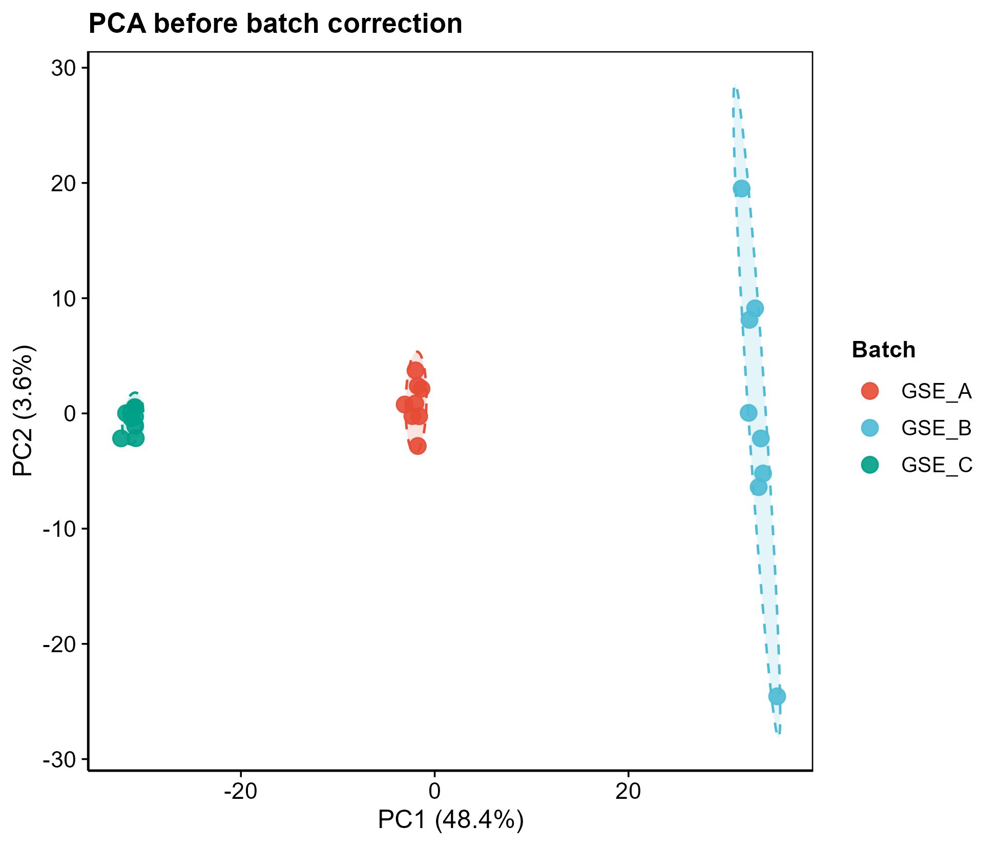

# 056 · GEO 多队列合并 + 批次校正

> 把一个目录里的多份 GEO 表达矩阵 → 一条命令 → 自动合并 + 去批次效应 + 校正前/后 PCA 与箱线图(独立图)。

| | |
|---|---|
| **语言 / 主依赖** | R · `limma` `ggplot2` `reshape2` |
| **一句话用途** | 多队列整合的批次效应去除与质控可视化 |
| **输入** | `example_data/`(目录,含 3 份合成队列 CSV) |
| **输出** | `results/` 合并矩阵+图 · 展示图见 `assets/` |

---

## ① 输入数据

**输入是一个目录**(`--input`),内含 **≥2 份 CSV**,每份 = 一个队列的表达矩阵:

| 列 | 类型 | 必需 | 说明 |
|------|------|:---:|------|
| 第 1 列 | str | ✔ | 基因名(统一为 geneSymbol,按交集合并) |
| 样本列 ×N | num | ✔ | 表达值 |

**约定**:**批次名 = 文件名**(如 `GSE_A.csv`→批次 GSE_A)。各队列以基因名取交集合并。

## ② 方法 / 原理

按 geneSymbol `merge` 取交集 → `limma::removeBatchEffect(batch=队列)` 线性消除批次均值偏移 → `prcomp` 标准化 PCA 对比校正前后。

> 方法引用:Ritchie *et al.*, *NAR* 2015(limma removeBatchEffect)。

## ③ 用途

非肿瘤/肿瘤研究常需合并多个 GEO 队列扩大样本量;本模块是 meta 分析与跨队列建模(→04/05 类)的基础前处理,直观验证批次效应是否被消除。

## ④ 特点 / 亮点

- **Turnkey**:把多份队列丢进一个目录 → 一条命令完成合并+校正+出图。
- **校正前后对照**:PCA(批次着色+椭圆)直观展示批次效应消除;箱线图查看分布对齐。
- **矢量**:每图 PDF + 300dpi PNG。

## ⑤ 输出结果图

| 文件 | 图型 | 说明 |
|------|------|------|
| `assets/PCA_before.png` / `PCA_after.png` | PCA | 校正前批次分离 → 校正后融合 |
| `assets/Boxplot_before.png` / `Boxplot_after.png` | 箱线图 | 样本表达分布对齐 |
| `results/merged_*_correction.csv` | 表 | 校正前/后合并矩阵 |




---

## 运行

```bash
Rscript 056_GEO_merge_batch_correction.R                       # 跑 3 份示例队列
Rscript 056_GEO_merge_batch_correction.R --input data/cohorts  # 你的队列目录
```

## 依赖安装

```r
if (!require("BiocManager")) install.packages("BiocManager"); BiocManager::install("limma")
install.packages(c("ggplot2","reshape2"))
```
