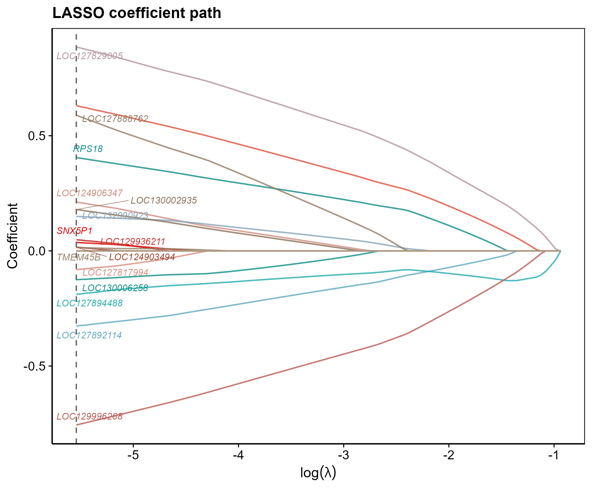

# 012 · LASSO 回归特征基因筛选

> 表达矩阵 + 候选基因 → 一条命令 → LASSO 收缩筛选特征基因 + 顶刊级 CV 曲线 / 系数路径图。

| | |
|---|---|
| **语言 / 主依赖** | R · `glmnet` `ggplot2` `ggrepel` |
| **一句话用途** | L1 正则从候选基因中选出与分组相关的最小特征集 |
| **输入** | `example_data/Sample_Type_Matrix.csv` + `candidate_genes.csv` |
| **输出** | `results/` 入选基因+图 · 展示图见 `assets/` |

---

## ① 输入数据

| 文件 | 必需 | 说明 |
|------|:---:|------|
| `--input` 表达矩阵 csv | ✔ | 首列基因,样本列名后缀分组(`*_con`/`*_tre`) |
| `--genes` 候选基因 csv | 可选 | 首列基因名;省略则用全部基因 |

**约定**:两组分类(后缀);候选基因取与矩阵的交集。

## ② 方法 / 原理

`glmnet(family="binomial", alpha=1)` 拟合 L1 正则 logistic 回归路径 → `cv.glmnet` 10 折交叉验证选 λ(min/1se)→ 取该 λ 下非零系数基因为特征。

> 方法引用:Friedman, Hastie & Tibshirani, *JSS* 2010(glmnet)。

## ③ 用途

从差异基因/候选集中进一步压缩到稳健的小特征集,供诊断模型(→016/063)与下游验证;是疾病标志物筛选的标准一步。

## ④ 特点 / 亮点

- **Turnkey**:零改动跑示例;`--lambda min/1se` 可切换收缩强度。
- **顶刊图**:CV 偏差曲线(λ.min/λ.1se 标注)+ 系数收缩路径(入选基因斜体标注)。
- **配套输出**:入选基因列表 + 其表达子矩阵,直接接下游。

## ⑤ 输出结果图

| 文件 | 图型 | 说明 |
|------|------|------|
| `assets/LASSO_CV_curve.png` | CV 曲线 | 偏差 vs log(λ),标注 λ.min / λ.1se |
| `assets/LASSO_coefficient_path.png` | 系数路径 | 各基因收缩轨迹,入选基因标注 |
| `results/LASSO_selected_genes.csv` | 表 | 入选基因 + 系数 |




---

## 运行

```bash
Rscript 012_LASSO_feature_selection.R                                  # 示例
Rscript 012_LASSO_feature_selection.R --input data/expr.csv --genes data/candidate.csv --lambda 1se
```

## 依赖安装

```r
install.packages(c("glmnet","ggplot2","ggrepel","reshape2"))
```
