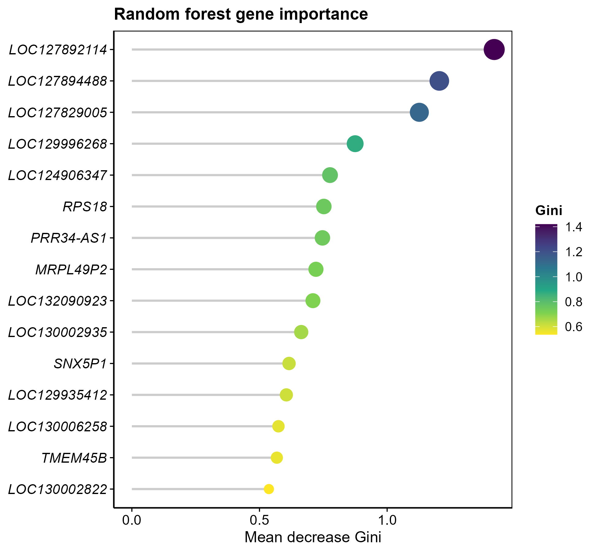

# 014 · 随机森林特征基因筛选

> 表达矩阵 + 候选基因 → 一条命令 → 随机森林重要性排序 + 顶刊级 OOB 错误率 / 重要性棒棒糖图。

| | |
|---|---|
| **语言 / 主依赖** | R · `randomForest` `ggplot2` |
| **一句话用途** | 用 Gini 重要性给候选基因排序、选特征 |
| **输入** | `example_data/Sample_Type_Matrix.csv` + `candidate_genes.csv` |
| **输出** | `results/` 重要性表+图 · 展示图见 `assets/` |

---

## ① 输入数据

同 [012](../012_LASSO特征基因筛选/):`--input` 表达矩阵(样本名后缀分组)+ `--genes` 候选基因(可选)。

## ② 方法 / 原理

`randomForest`(默认 500 树)以分组为响应拟合 → `importance()` 取 `MeanDecreaseGini` 排序 → 阈值/topN 选特征。OOB 错误率曲线辅助判断树数是否足够。

> 方法引用:Breiman, *Machine Learning* 2001(Random Forests)。

## ③ 用途

非线性、抗共线的特征重要性评估,常与 LASSO/SVM-RFE 取交集(→015)得到稳健特征集。

## ④ 特点 / 亮点

- **Turnkey**:零改动跑示例;`--ntree/--top/--threshold` 可调。
- **顶刊图**:OOB 错误率多类曲线 + viridis 重要性棒棒糖(基因名斜体)。

## ⑤ 输出结果图

| 文件 | 图型 | 说明 |
|------|------|------|
| `assets/RF_importance_lollipop.png` | 棒棒糖图 | top 基因 Gini 重要性 |
| `assets/RF_OOB_error.png` | 折线 | OOB / 各类错误率 vs 树数 |
| `results/RF_gene_importance.csv` | 表 | 全基因重要性 |



---

## 运行

```bash
Rscript 014_RandomForest_feature_selection.R                                  # 示例
Rscript 014_RandomForest_feature_selection.R --input data/expr.csv --top 20 --ntree 1000
```

## 依赖安装

```r
install.packages(c("randomForest","ggplot2","reshape2","viridisLite"))
```
