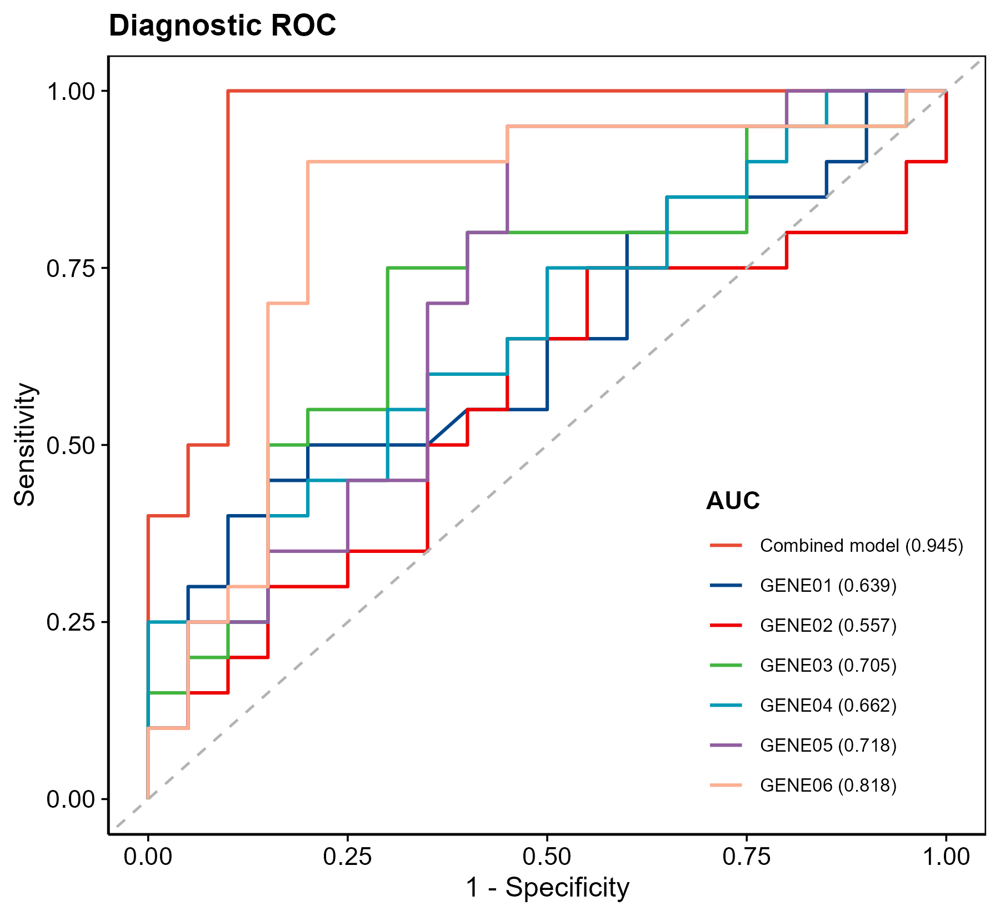
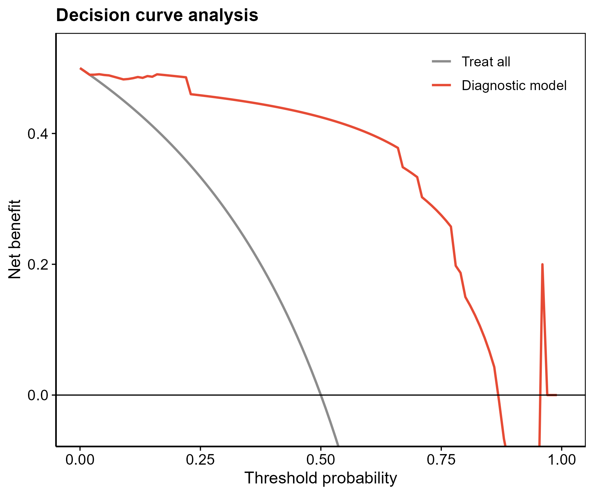

# 016 · 诊断模型 — ROC / 校准 / DCA / 列线图

> 表达矩阵 + 诊断基因 → 一条命令 → logistic 诊断模型 + 全套临床评价图(列线图/校准/DCA/ROC/OR森林/箱线)。

| | |
|---|---|
| **语言 / 主依赖** | R · `rms` `rmda` `pROC` `ggplot2` |
| **一句话用途** | 构建并多角度验证基因诊断模型 |
| **输入** | `example_data/Sample_Type_Matrix.csv` + `diagnostic_genes.csv` |
| **输出** | `results/` 表+图 · 展示图见 `assets/` |

---

## ① 输入数据

| 文件 | 必需 | 说明 |
|------|:---:|------|
| `--input` 表达矩阵 csv | ✔ | 首列基因,样本名后缀分组(`*_con`/`*_dis`) |
| `--genes` 诊断基因 csv | ✔ | 首列=入选诊断基因(通常来自 04 类筛选) |

## ② 方法 / 原理

`rms::lrm` 多基因 logistic 回归 → `nomogram` 列线图 → `calibrate`(bootstrap)校准曲线 → `rmda::decision_curve` 决策曲线 → `pROC` 联合/单基因 ROC → `glm` 提取 OR(95%CI)森林图。

> 方法引用:Harrell, *rms* package;Vickers & Elkin, *Med Decis Making* 2006(DCA)。

## ③ 用途

把筛选出的特征基因落地成可用的诊断打分模型,并用 ROC(区分度)、校准(一致性)、DCA(临床效用)三件套全面评价。

## ④ 特点 / 亮点

- **Turnkey**:零改动跑示例;自动检测分组、处理完全分离。
- **顶刊全家桶**:列线图 · 校准曲线 · DCA · ROC(联合+单基因)· OR 森林图 · 基因箱线图,base 图全升级 ggplot/theme_pub。

## ⑤ 输出结果图

| 文件 | 图型 | 说明 |
|------|------|------|
| `assets/Nomogram.png` | 列线图 | 风险打分 |
| `assets/Calibration.png` | 校准曲线 | 预测 vs 实际一致性 |
| `assets/DCA.png` | 决策曲线 | 临床净获益 |
| `assets/ROC.png` | ROC | 联合模型 + 单基因 |
| `assets/OR_forest.png` · `Gene_boxplot.png` | 森林/箱线 | OR + 表达差异 |




---

## 运行

```bash
Rscript 016_diagnostic_model.R                              # 示例
Rscript 016_diagnostic_model.R --input data/expr.csv --genes data/genes.csv --case _dis
```

## 依赖安装

```r
install.packages(c("rms","rmda","pROC","ggplot2"))
```
