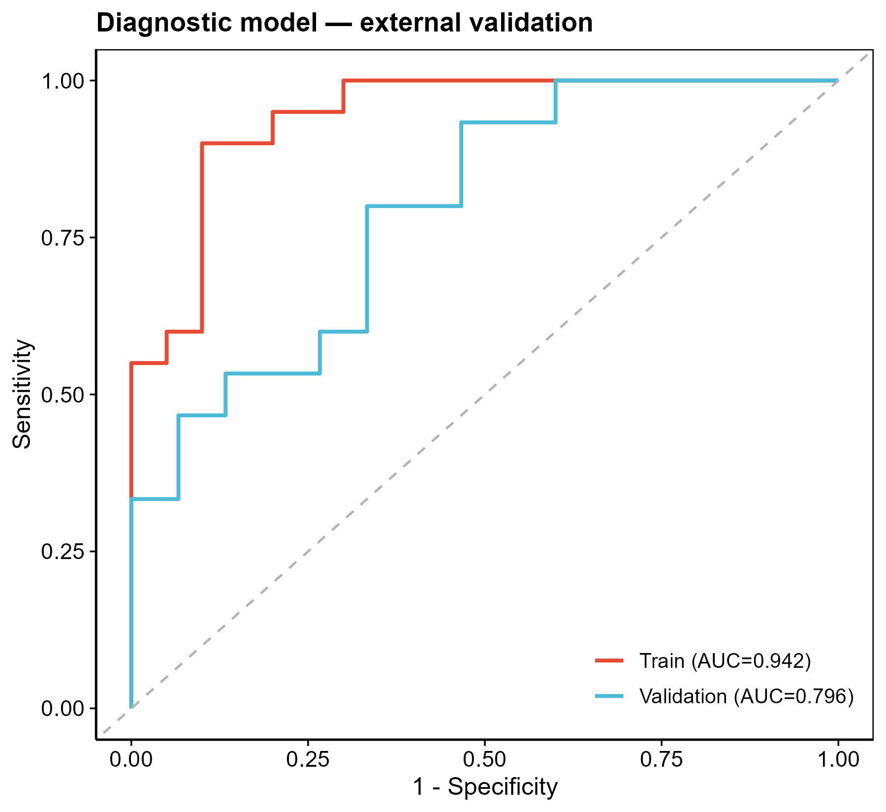

# 063 · GEO 诊断模型外部验证

> 训练队列 + 独立验证队列 → 一条命令 → 训练/验证 ROC 对比 + 验证集校准曲线(看模型泛化)。

| | |
|---|---|
| **语言 / 主依赖** | R · `rms` `pROC` `ggplot2` |
| **一句话用途** | 诊断模型的外部(独立队列)验证 |
| **输入** | `example_data/`(train + validation 矩阵 + 基因列表) |
| **输出** | `results/` AUC+图 · 展示图见 `assets/` |

---

## ① 输入数据

| 文件 | 必需 | 说明 |
|------|:---:|------|
| `--train` 训练矩阵 csv | ✔ | 首列基因,样本名后缀分组(`*_con`/`*_dis`) |
| `--valid` 验证矩阵 csv | 可选 | 同格式独立队列;省略则训练集自评 |
| `--genes` 诊断基因 csv | ✔ | 模型基因 |

## ② 方法 / 原理

`rms::lrm` 在训练队列拟合 logistic 模型 → 在验证队列上预测 → `pROC` 计算两队列 AUC,叠加 ROC 对比;按分位数分箱绘验证集校准曲线。

## ③ 用途

与 016(内部评价)互补:用**独立队列**检验诊断模型是否过拟合、能否泛化,是发表的关键证据。

## ④ 特点 / 亮点

- **Turnkey**:两份矩阵 + 基因即跑;自动对齐共有基因。
- **顶刊图**:训练 vs 验证 ROC 叠加(AUC 直观对比)+ 验证集校准曲线。

## ⑤ 输出结果图

| 文件 | 图型 | 说明 |
|------|------|------|
| `assets/ROC_train_vs_valid.png` | ROC | 训练/验证 AUC 对比 |
| `assets/Calibration_valid.png` | 校准曲线 | 验证集一致性 |
| `results/AUC.csv` | 表 | 各队列 AUC |



---

## 运行

```bash
Rscript 063_diagnostic_validation.R                                              # 示例
Rscript 063_diagnostic_validation.R --train data/train.csv --valid data/valid.csv --genes data/genes.csv
```

## 依赖安装

```r
install.packages(c("rms","pROC","ggplot2"))
```
