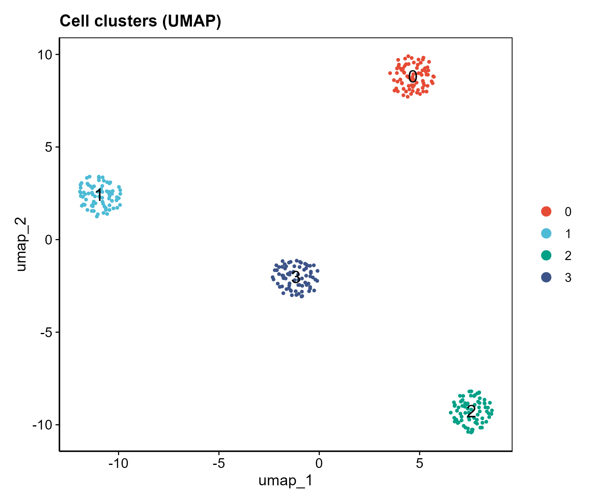

# 046 · 单细胞发表级图(Seurat 标准流程)

> 计数矩阵 → 一条命令 → Seurat 全流程 + 发表级 UMAP / marker 点图 / marker 热图 / 目标基因图。

| | |
|---|---|
| **语言 / 主依赖** | R · `Seurat` `ggplot2` |
| **一句话用途** | 单细胞标准分析 + 顶刊级标配图 |
| **输入** | `example_data/counts.csv` |
| **输出** | `results/`(对象+marker+图)· 展示图见 `assets/` |

---

## ① 输入数据

计数矩阵 CSV:首列基因名,其余列 = 细胞(原始 counts)。也可用 `--genes "CD3D,MS4A1"` 指定要展示的目标基因。

## ② 方法 / 原理

Seurat 标准流程:QC → `NormalizeData` → HVG → `ScaleData` → `RunPCA` → `FindClusters` → `RunUMAP` → `FindAllMarkers`,取每簇 top marker 出图。

> 方法引用:Hao *et al.*, *Cell* 2021(Seurat v4/v5)。

## ③ 用途

任意单细胞/核 RNA-seq 的聚类分群、marker 识别与发表级展示,是单细胞分析的主干。

## ④ 特点 / 亮点

- **Turnkey**:counts 即跑全流程;UMAP 失败自动回退 tSNE。
- **顶刊图**:UMAP(期刊离散配色)· marker 点图 · marker 热图(viridis)· 目标基因 FeaturePlot(viridis)· 小提琴图——原 Set3/grey-red 默认配色已升级。

## ⑤ 输出结果图

| 文件 | 图型 | 说明 |
|------|------|------|
| `assets/UMAP_clusters.png` | UMAP | 聚类分群 |
| `assets/Marker_dotplot.png` | 点图 | 各簇 top marker(块对角) |
| `assets/Marker_heatmap.png` | 热图 | top marker 表达 |
| `assets/<gene>_FeaturePlot.png` · `<gene>_violin.png` | 特征图/小提琴 | 目标基因分布 |




---

## 运行

```bash
Rscript 046_scRNA_publication_figures.R                                   # 示例
Rscript 046_scRNA_publication_figures.R --input data/counts.csv --genes "CD3D,MS4A1" --resolution 0.6
```

## 依赖安装

```r
install.packages(c("Seurat","ggplot2","dplyr"))
```
