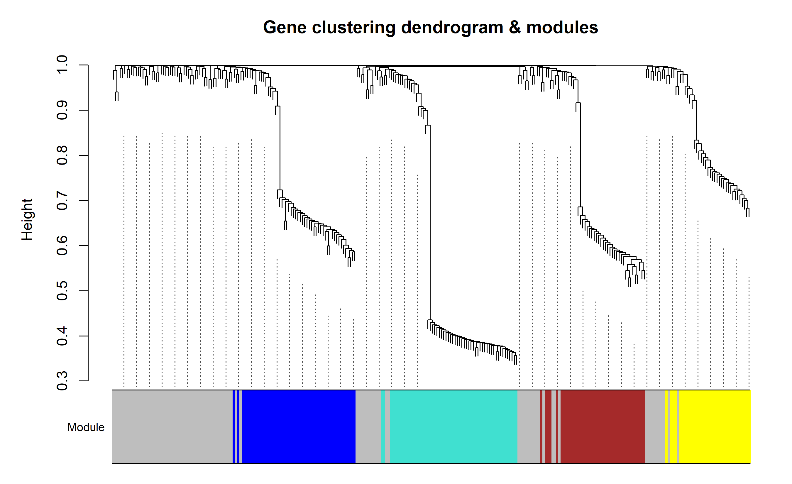

# 054 · WGCNA 共表达网络分析

> 表达矩阵 + 性状 → 一条命令 → 软阈值选择 + 模块识别 + 模块-性状相关热图。

| | |
|---|---|
| **语言 / 主依赖** | R · `WGCNA` `ComplexHeatmap` `ggplot2` |
| **一句话用途** | 找共表达模块并关联表型,定位关键模块 |
| **输入** | `example_data/expr_matrix.csv` + `traits.csv` |
| **输出** | `results/` 模块表+图 · 展示图见 `assets/` |

---

## ① 输入数据

| 文件 | 必需 | 说明 |
|------|:---:|------|
| `--input` 表达矩阵 csv | ✔ | 首列基因,样本列(建议方差较大的基因) |
| `--traits` 性状表 csv | ✔ | 首列 `Sample`(对应样本),其余数值性状(分组/分级等) |

## ② 方法 / 原理

`pickSoftThreshold` 选无标度软阈值 → `blockwiseModules` 构建 TOM 并动态剪切识别模块 → `moduleEigengenes` 计算模块特征基因(ME)→ ME 与性状求相关(+p),定位性状关联模块。

> 方法引用:Langfelder & Horvath, *BMC Bioinformatics* 2008(WGCNA)。

## ③ 用途

从表达谱中发现协同表达的基因模块,并找出与疾病/表型显著相关的模块及其 hub 基因,供下游富集(→007)与机制研究。

## ④ 特点 / 亮点

- **Turnkey**:矩阵+性状即跑;软阈值自动选(可 `--power` 指定)。
- **顶刊图**:无标度拟合图 + 模块树状图(彩色模块条)+ 模块-性状相关热图(相关+p)。

## ⑤ 输出结果图

| 文件 | 图型 | 说明 |
|------|------|------|
| `assets/Module_trait_heatmap.png` | 相关热图 | 模块×性状(相关+p),定位关键模块 |
| `assets/Module_dendrogram.png` | 树状图 | 基因聚类 + 模块颜色 |
| `assets/SoftThreshold.png` | 散点 | 无标度拓扑 R² vs power |




---

## 运行

```bash
Rscript 054_WGCNA_coexpression.R                              # 示例
Rscript 054_WGCNA_coexpression.R --input data/expr.csv --traits data/traits.csv --power 6
```

## 依赖安装

```r
BiocManager::install(c("WGCNA","ComplexHeatmap","impute","preprocessCore","GO.db"))
install.packages(c("ggplot2","circlize"))
```
