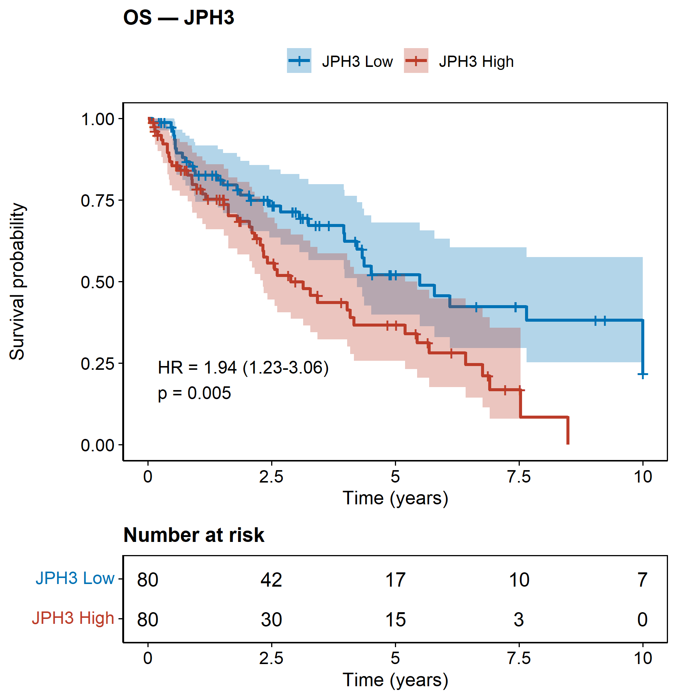

# 048 · TCGA 单基因多终点生存曲线

> 单基因表达 + 生存数据 → 一条命令 → OS/DSS/DFI/PFI 四终点高低表达 KM 曲线。

| | |
|---|---|
| **语言 / 主依赖** | R · `survival` `survminer` |
| **一句话用途** | 单基因预后价值的多终点 KM 评估 |
| **输入** | `example_data/gene_survival.csv` |
| **输出** | `results/` 汇总 + `assets/` 各终点 KM |

---

## ① 输入数据

CSV,含目标基因表达列 + 各终点成对列 `<EP>.time`(天)与 `<EP>`(0/1),EP ∈ OS/DSS/DFI/PFI(有几个画几个)。

## ② 方法 / 原理

按基因表达中位数分高/低组 → 各终点 `survfit` KM + `coxph` 求 HR/95%CI/p。

## ③ 用途

快速评估单个基因在多种生存终点上的预后意义(TCGA 泛癌预后分析标配)。

## ④ 特点 / 亮点

- **Turnkey**:一表即出 4 张 KM;自动识别可用终点。
- **顶刊图**:每终点独立 KM(HR/p + risk table)。

## ⑤ 输出结果图

| 文件 | 图型 |
|------|------|
| `assets/KM_OS.png` / `KM_DSS.png` / `KM_DFI.png` / `KM_PFI.png` | 各终点 KM |



---

## 运行

```bash
Rscript 048_single_gene_survival.R                              # 示例
Rscript 048_single_gene_survival.R --input data/gene_survival.csv --gene TP53
```

## 依赖安装

```r
install.packages(c("survival","survminer"))
```
