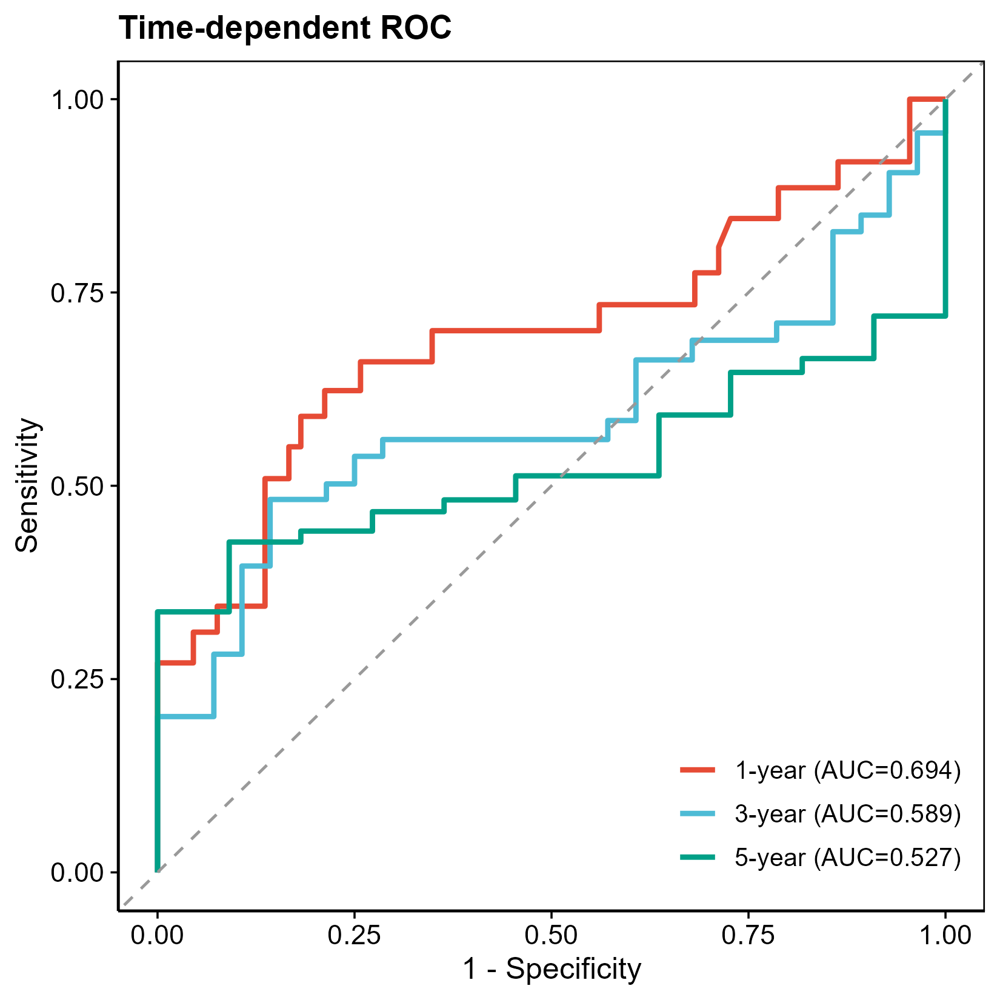

# 057 · TCGA 预后风险模型可视化

> 风险评分文件 → 一条命令 → 预后签名标准五件套(风险分布/生存状态/基因热图/KM/时间ROC)。

| | |
|---|---|
| **语言 / 主依赖** | R · `survival` `survminer` `timeROC` `ComplexHeatmap` |
| **一句话用途** | 预后风险签名的完整可视化 |
| **输入** | `example_data/risk.csv` |
| **输出** | `results/` 表+图 · 展示图见 `assets/` |

---

## ① 输入数据

CSV,必含:`futime`(随访天数)、`fustat`(0存活/1死亡)、`riskScore`、`risk`(low/high);其余数值列视为风险基因表达。

## ② 方法 / 原理

按 riskScore 排序展示风险分布与生存状态 → 风险基因 z-score 热图 → `survfit`+`coxph` KM 曲线(HR/p)→ `timeROC` 1/3/5 年时间依赖 ROC。

> 方法引用:`survminer`(Kassambara);Blanche *et al.*, *Stat Med* 2013(timeROC)。

## ③ 用途

TCGA/队列预后签名(来自 Cox/LASSO-Cox)的标准展示,验证风险分层的预后区分能力。

## ④ 特点 / 亮点

- **Turnkey**:risk.csv 即跑五图;自动分组、自动跳过超随访期的时点。
- **顶刊图**:风险分布 + 生存状态 + 热图 + KM(含 risk table)+ 时间 ROC。

## ⑤ 输出结果图

| 文件 | 图型 |
|------|------|
| `assets/KM_curve.png` | KM 生存曲线(HR/p + risk table) |
| `assets/timeROC.png` | 1/3/5 年时间依赖 ROC |
| `assets/Risk_distribution.png` · `Survival_status.png` · `Risk_heatmap.png` | 风险三联图 |




---

## 运行

```bash
Rscript 057_prognostic_risk_model.R                              # 示例
Rscript 057_prognostic_risk_model.R --input data/risk.csv
```

## 依赖安装

```r
install.packages(c("survival","survminer","timeROC","circlize")); BiocManager::install("ComplexHeatmap")
```
