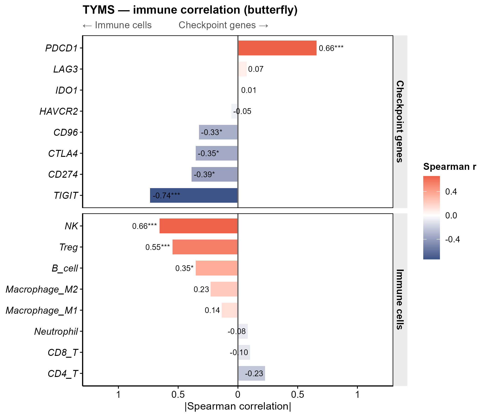

# 060 · 单基因免疫双蝴蝶相关图

> 目标基因 + 免疫数据 → 一条命令 → 基因 vs 免疫细胞 / 检查点基因的两侧发散相关蝴蝶图。

| | |
|---|---|
| **语言 / 主依赖** | R · `ggplot2` |
| **一句话用途** | 一图看尽目标基因的免疫相关全景 |
| **输入** | `example_data/`(expression + immune_fraction + checkpoint_genes) |
| **输出** | `results/correlation.csv` + `assets/` |

---

## ① 输入数据

| 文件 | 说明 |
|------|------|
| `--expr` 表达矩阵 csv | 首列基因(含目标基因 + 检查点基因) |
| `--immune` 免疫比例 csv | 首列 `Sample`,其余免疫细胞比例 |
| `--checkpoints` txt | 检查点基因列表(缺省用内置常见检查点) |

## ② 方法 / 原理

目标基因表达分别与各免疫细胞比例、各检查点基因表达求 Spearman 相关 → 两侧发散条形(蝴蝶)图,色=相关方向,标注 r + 显著性。

## ③ 用途

肿瘤免疫:一张图同时展示目标基因与免疫浸润、与免疫检查点的关联,提示其免疫调控角色与 ICB 潜在关系。

## ④ 特点 / 亮点

- **Turnkey**:三输入即跑;纯 ggplot(替换原 linkET),无重型依赖。
- **顶刊图**:双面板发散蝴蝶,相关+显著性一目了然。

## ⑤ 输出结果图

| 文件 | 图型 |
|------|------|
| `assets/Immune_butterfly.png` | 双蝴蝶相关图 |



---

## 运行

```bash
Rscript 060_immune_butterfly.R                                       # 示例
Rscript 060_immune_butterfly.R --expr data/expr.csv --immune data/immune.csv --gene TP53
```

## 依赖安装

```r
install.packages("ggplot2")
```
