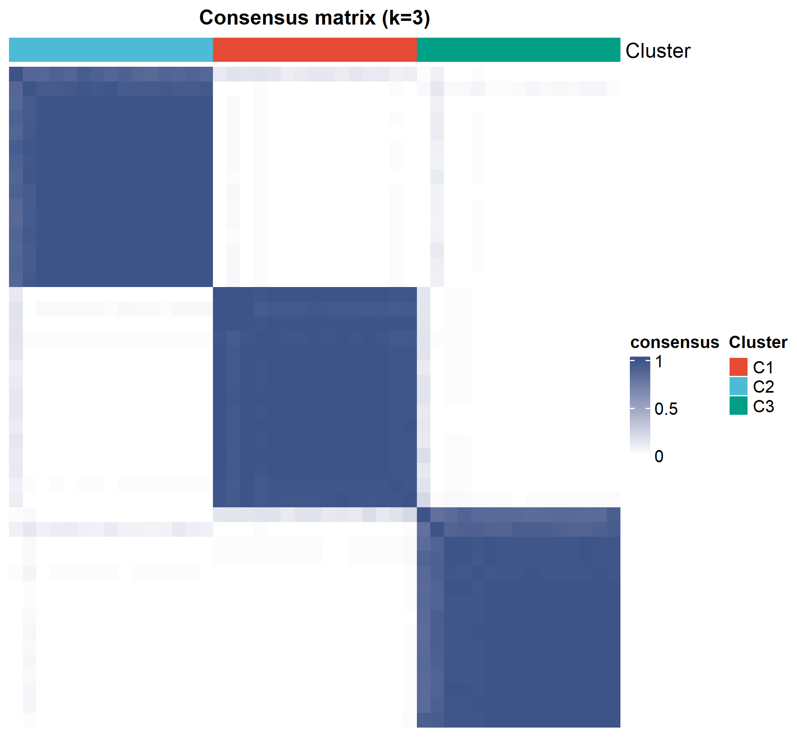

# 084 · NMF + ConsensusClusterPlus 分子分型

> 特征×样本矩阵 → 一条命令 → 无监督分子分型(NMF 秩选择 + 共识矩阵 + 分型热图)。

| | |
|---|---|
| **语言 / 主依赖** | R · `NMF` `ConsensusClusterPlus` `ComplexHeatmap` |
| **一句话用途** | 把样本无监督分成稳健的分子亚型 |
| **输入** | `example_data/feature_matrix.csv` |
| **输出** | `results/` 分型表+图 · 展示图见 `assets/` |

---

## ① 输入数据

CSV,首列特征名(基因/免疫评分/通路评分),其余列=样本;值非负。

## ② 方法 / 原理

`NMF` 在 k=kmin..kmax 做秩选择(cophenetic 相关)→ 最优 k 提取亚型;`ConsensusClusterPlus` 重抽样共识聚类输出共识矩阵(稳健性证据)→ 分型注释特征热图。

> 方法引用:Brunet *et al.*, *PNAS* 2004(NMF 分型);Wilkerson & Hayes, *Bioinformatics* 2010(CCP)。

## ③ 用途

肿瘤/疾病分子分型、免疫共浸润分型、通路活性分型——发现具有不同分子特征的患者亚组。

## ④ 特点 / 亮点

- **Turnkey**:矩阵即跑;`--k` 可手动指定亚型数(默认 cophenetic 自动选,建议结合秩选择/共识图人工确认)。
- **顶刊图**:NMF 秩选择曲线 + 共识矩阵热图(分型金标准图)+ 分型注释特征热图。

## ⑤ 输出结果图

| 文件 | 图型 | 说明 |
|------|------|------|
| `assets/Consensus_matrix.png` | 共识矩阵 | 分型稳健性(对角块=亚型) |
| `assets/NMF_rank_survey.png` | 曲线 | cophenetic vs k |
| `assets/Subtype_heatmap.png` | 热图 | 各亚型特征模式 |



---

## 运行

```bash
Rscript 084_NMF_consensus_subtyping.R                              # 示例(自动选 k)
Rscript 084_NMF_consensus_subtyping.R --input data/mat.csv --k 3   # 指定 3 亚型
```

## 依赖安装

```r
install.packages("NMF"); BiocManager::install(c("ConsensusClusterPlus","ComplexHeatmap"))
```
